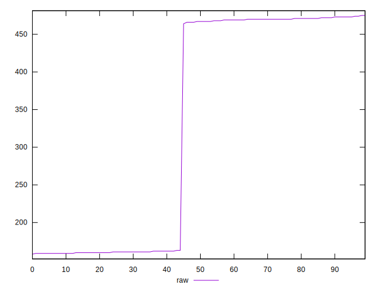
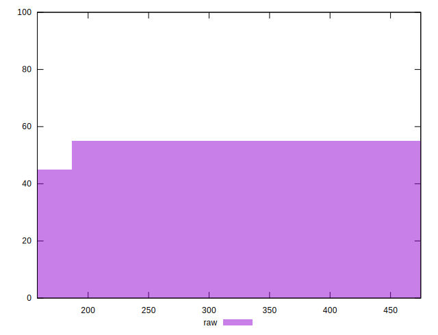

# //render-blocking-resources/samples/pages+cached+noexternal

[→ Parent](../..)


## Raw


```yaml
p90min: 158
p90max: 472
p90range: 314
p90mean: 314.8666666666667
p90median: 313.5
p90stdev: 154.4745358375361
p90skewness: 0.00011841376813223923
p90eccentricity: 1.0000000000000002
p90discretization: 6.428571428571429
outlandishness: 1.1033672041293012

```


## Score


```yaml
p90min: 0.6527777777777778
p90max: 0.8674999999999999
p90range: 0.21472222222222215
p90mean: 0.7373487654320995
p90median: 0.6566666666666666
p90stdev: 0.10261571441136513
p90skewness: 0.45561781509353144
p90eccentricity: 1.0000000000000013
p90discretization: 5.625
outlandishness: 1.0356370583665744

```

