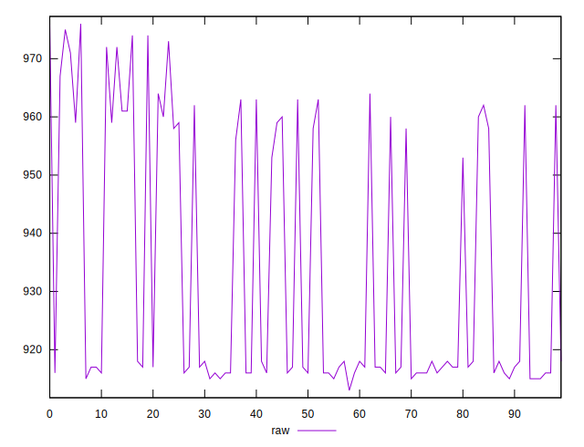
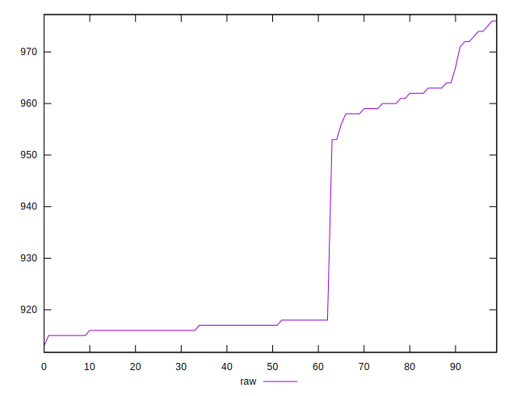
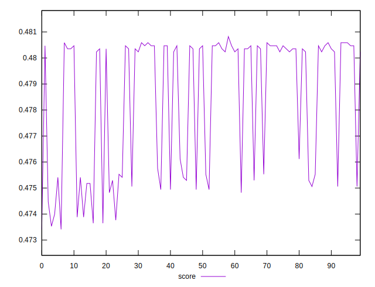

# //render-blocking-resources/samples/pages+cached+nointeractive

[→ Parent](../..)


## Raw


```yaml
p90min: 913
p90max: 967
p90range: 54
p90mean: 929.9230769230769
p90median: 917
p90stdev: 20.308732907071924
p90skewness: 0.849998888111971
p90eccentricity: 0.9999999999999996
p90discretization: 6.066666666666666
outlandishness: 1.0084851249639046

```


## Score


```yaml
p90min: 0.4744705882352941
p90max: 0.4808235294117647
p90range: 0.006352941176470617
p90mean: 0.47883257918552047
p90median: 0.4803529411764706
p90stdev: 0.0023892626949496326
p90skewness: -0.8499988881119717
p90eccentricity: 1.0000000000000018
p90discretization: 6.066666666666666
outlandishness: 0.998066366268454

```


## P Score


```yaml
p90min: 0.4744705882352941
p90max: 0.4808235294117647
p90range: 0.006352941176470617
p90mean: 0.47883257918552047
p90median: 0.4803529411764706
p90stdev: 0.0023892626949496326
p90skewness: -0.8499988881119717
p90eccentricity: 1.0000000000000018
p90discretization: 6.066666666666666
outlandishness: 0.998066366268454

```


## Score Difference


```yaml
p90min: -0.004823529411764671
p90max: 0.004823529411764671
p90range: 0.009647058823529342
p90mean: 0.00008661926308984745
p90median: -0.0003529411764706114
p90stdev: 0.002400858888156398
p90skewness: 0.6189828758269509
p90eccentricity: 0.9999999999999992
p90discretization: 4.7894736842105265
outlandishness: 0.1247038538649886

```


## P Score Difference


```yaml
p90min: 0
p90max: 0
p90range: 0
p90mean: 0
p90median: 0
p90stdev: 0
p90skewness: .nan
p90eccentricity: .nan
p90discretization: 91
outlandishness: .nan

```

