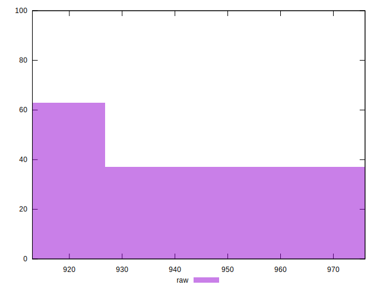
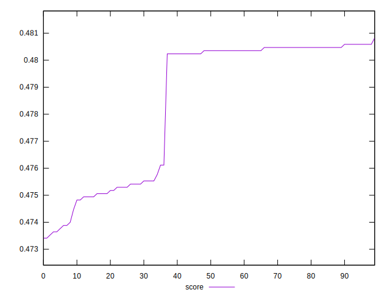

# //render-blocking-resources/samples/pages+cached+nointeractive

[→ Parent](../..)


## Raw


```yaml
p90min: 913
p90max: 964
p90range: 51
p90mean: 929.5111111111111
p90median: 917
p90stdev: 20.039541159331538
p90skewness: 0.8858542004151149
p90eccentricity: 1.0000000000000009
p90discretization: 6.428571428571429
outlandishness: 1.0093792583552939

```


## Score


```yaml
p90min: 0.47341176470588237
p90max: 0.4804705882352941
p90range: 0.0070588235294117285
p90mean: 0.478120261437908
p90median: 0.48023529411764704
p90stdev: 0.002750413776303013
p90skewness: -0.45733627837891
p90eccentricity: 1.0000000000000002
p90discretization: 4.7368421052631575
outlandishness: 1.0010424793237176

```

