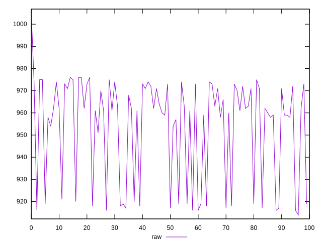
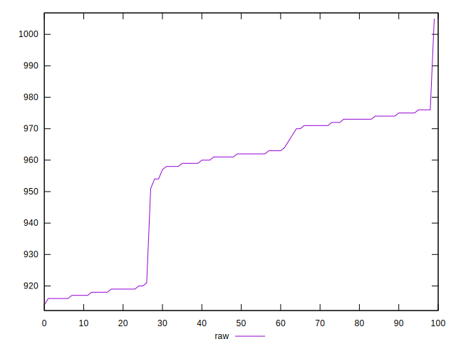
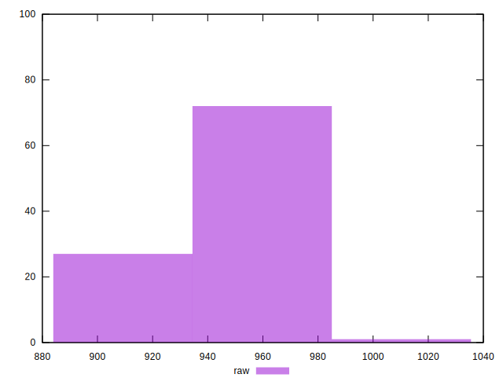
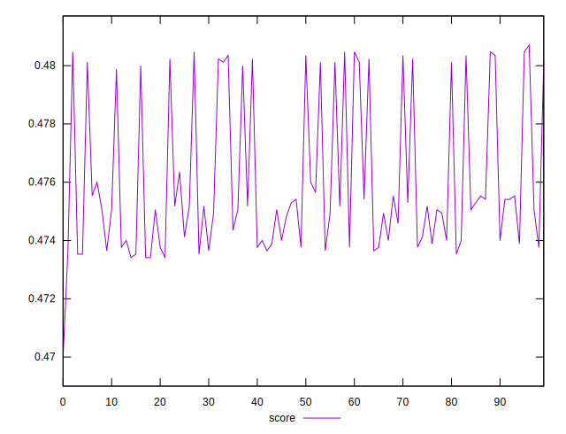
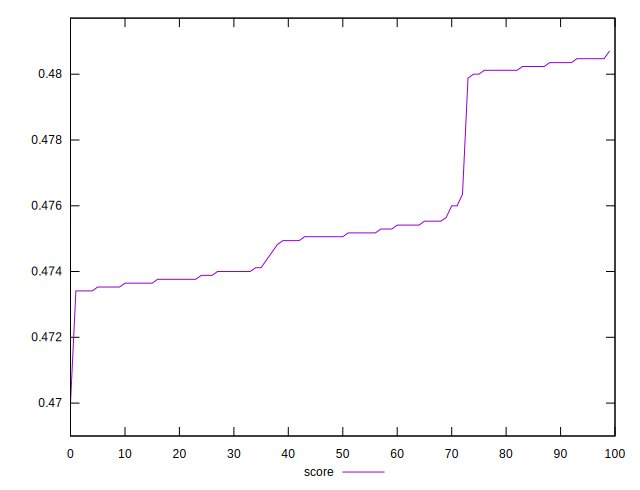
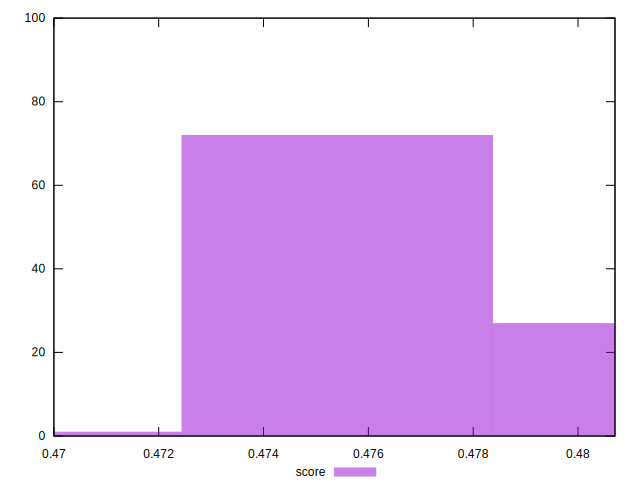

# //render-blocking-resources/samples/pages+cached

[→ Parent](../..)


## Raw


```yaml
p90min: 917
p90max: 976
p90range: 59
p90mean: 956.5604395604396
p90median: 962
p90stdev: 20.476847709412667
p90skewness: -1.1227903770635892
p90eccentricity: 0.9999999999999999
p90discretization: 3.7916666666666665
outlandishness: 0.9942158853717318

```


## Score


```yaml
p90min: 0.47341176470588237
p90max: 0.4803529411764706
p90range: 0.006941176470588228
p90mean: 0.4756987718164187
p90median: 0.47505882352941176
p90stdev: 0.0024090409069897267
p90skewness: 1.1227903770638277
p90eccentricity: 1.0000000000000002
p90discretization: 3.7916666666666665
outlandishness: 1.0013708075160799

```


## P Score


```yaml
p90min: 0.47341176470588237
p90max: 0.4803529411764706
p90range: 0.006941176470588228
p90mean: 0.4756987718164187
p90median: 0.47505882352941176
p90stdev: 0.0024090409069897267
p90skewness: 1.1227903770638277
p90eccentricity: 1.0000000000000002
p90discretization: 3.7916666666666665
outlandishness: 1.0013708075160799

```


## Score Difference


```yaml
p90min: -0.004941176470588227
p90max: 0.004823529411764671
p90range: 0.009764705882352898
p90mean: -0.0008442146089204831
p90median: -0.00047058823529411153
p90stdev: 0.0033549917591963736
p90skewness: 0.578244114748278
p90eccentricity: 1
p90discretization: 3.5
outlandishness: 0.1479362433719709

```


## P Score Difference


```yaml
p90min: 0
p90max: 0
p90range: 0
p90mean: 0
p90median: 0
p90stdev: 0
p90skewness: .nan
p90eccentricity: .nan
p90discretization: 91
outlandishness: .nan

```

