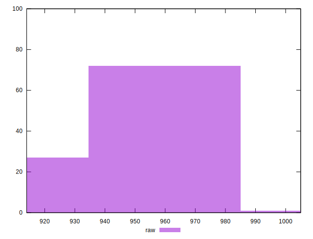
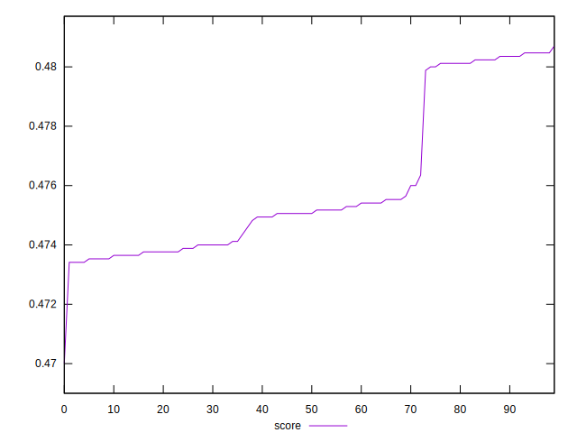

# //render-blocking-resources/samples/pages+cached

[→ Parent](../..)


## Raw


```yaml
p90min: 917
p90max: 976
p90range: 59
p90mean: 956.5604395604396
p90median: 962
p90stdev: 20.476847709412667
p90skewness: -1.1227903770635892
p90eccentricity: 0.9999999999999999
p90discretization: 3.7916666666666665
outlandishness: 0.9942158853717318

```


## Score


```yaml
p90min: 0.47341176470588237
p90max: 0.4803529411764706
p90range: 0.006941176470588228
p90mean: 0.4756987718164187
p90median: 0.47505882352941176
p90stdev: 0.0024090409069897267
p90skewness: 1.1227903770638277
p90eccentricity: 1.0000000000000002
p90discretization: 3.7916666666666665
outlandishness: 1.0013708075160799

```

