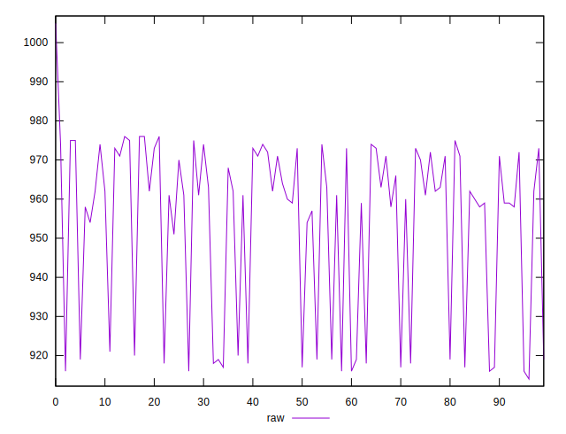
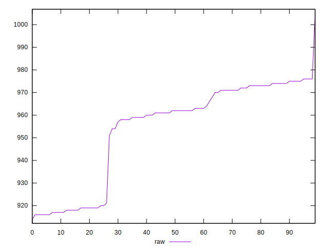

# //render-blocking-resources/samples/pages+cached

[→ Parent](../..)


## Raw


```yaml
p90min: 914
p90max: 974
p90range: 60
p90mean: 951.0555555555555
p90median: 961
p90stdev: 22.475844372279173
p90skewness: -0.6963026706713638
p90eccentricity: 1
p90discretization: 3.75
outlandishness: 1.0057586024748004

```


## Score


```yaml
p90min: 0.47
p90max: 0.4803529411764706
p90range: 0.01035294117647062
p90mean: 0.47553202614379086
p90median: 0.47505882352941176
p90stdev: 0.002391576771694882
p90skewness: 1.0557123486372797
p90eccentricity: 0.9999999999999993
p90discretization: 3.6
outlandishness: 1.0020731935363365

```

