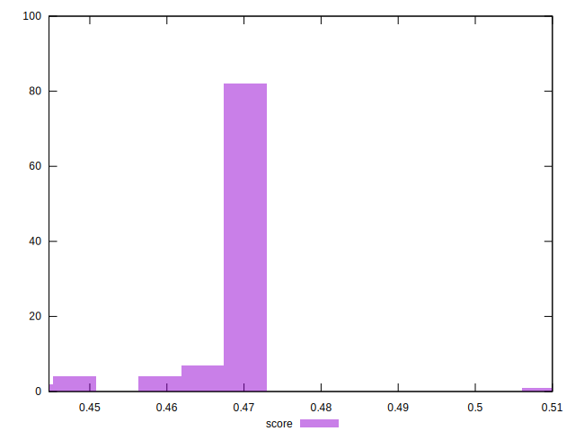

# //render-blocking-resources/samples/pages

[→ Parent](../..)


## Raw


```yaml
p90min: 991
p90max: 1094
p90range: 103
p90mean: 1007.0769230769231
p90median: 1002
p90stdev: 19.059323679080876
p90skewness: 2.6924627599089326
p90eccentricity: 0.9999999999999996
p90discretization: 2.676470588235294
outlandishness: 1.0223122124249326

```


## Score


```yaml
p90min: 0.45952941176470585
p90max: 0.4716470588235294
p90range: 0.012117647058823566
p90mean: 0.46975565610859743
p90median: 0.4703529411764706
p90stdev: 0.002242273374009518
p90skewness: -2.692462759908977
p90eccentricity: 1.0000000000000002
p90discretization: 2.676470588235294
outlandishness: 0.9947460730131018

```

