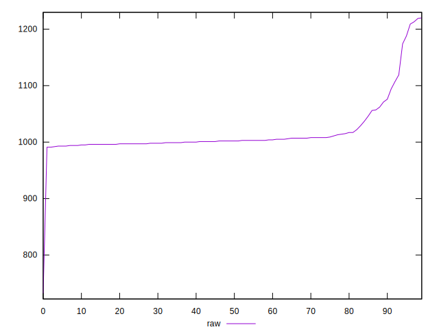
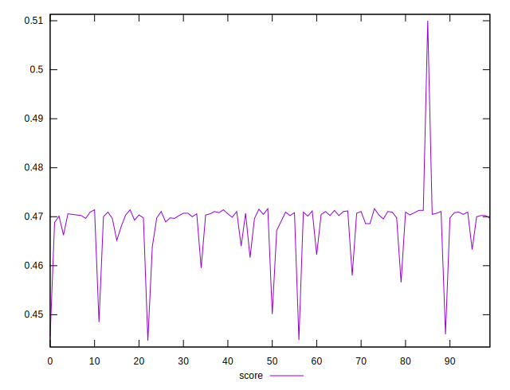

# //render-blocking-resources/samples/pages

[→ Parent](../..)


## Raw


```yaml
p90min: 991
p90max: 1094
p90range: 103
p90mean: 1007.0769230769231
p90median: 1002
p90stdev: 19.059323679080876
p90skewness: 2.6924627599089326
p90eccentricity: 0.9999999999999996
p90discretization: 2.676470588235294
outlandishness: 1.0223122124249326

```


## Score


```yaml
p90min: 0.45952941176470585
p90max: 0.4716470588235294
p90range: 0.012117647058823566
p90mean: 0.46975565610859743
p90median: 0.4703529411764706
p90stdev: 0.002242273374009518
p90skewness: -2.692462759908977
p90eccentricity: 1.0000000000000002
p90discretization: 2.676470588235294
outlandishness: 0.9947460730131018

```


## P Score


```yaml
p90min: 0.45952941176470585
p90max: 0.4716470588235294
p90range: 0.012117647058823566
p90mean: 0.46975565610859743
p90median: 0.4703529411764706
p90stdev: 0.002242273374009518
p90skewness: -2.692462759908977
p90eccentricity: 1.0000000000000002
p90discretization: 2.676470588235294
outlandishness: 0.9947460730131018

```


## Score Difference


```yaml
p90min: -0.0032941176470587807
p90max: 0.0028235294117647247
p90range: 0.0061176470588235055
p90mean: -0.00038526179702647593
p90median: -0.00047058823529411153
p90stdev: 0.0009320935238994215
p90skewness: 0.6085084341575505
p90eccentricity: 0.9999999999999997
p90discretization: 2.935483870967742
outlandishness: 0.689903049412174

```


## P Score Difference


```yaml
p90min: 0
p90max: 0
p90range: 0
p90mean: 0
p90median: 0
p90stdev: 0
p90skewness: .nan
p90eccentricity: .nan
p90discretization: 91
outlandishness: .nan

```

