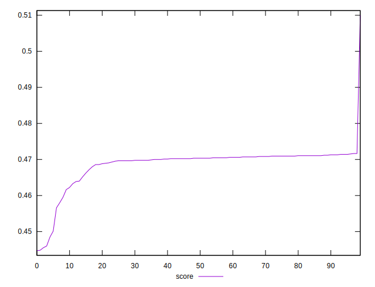

# //render-blocking-resources/samples/pages

[→ Parent](../..)


## Raw


```yaml
p90min: 732
p90max: 1071
p90range: 339
p90mean: 1002.2888888888889
p90median: 1001
p90stdev: 32.37874626783043
p90skewness: -6.133051089709239
p90eccentricity: 1.0000000000000013
p90discretization: 2.727272727272727
outlandishness: 1.032102917499962

```


## Score


```yaml
p90min: 0.4447058823529412
p90max: 0.4711764705882353
p90range: 0.026470588235294135
p90mean: 0.4677673202614379
p90median: 0.4702352941176471
p90stdev: 0.00634797621960482
p90skewness: -2.62487454877479
p90eccentricity: 0.9999999999999999
p90discretization: 2.3684210526315788
outlandishness: 1.0032207692614292

```

