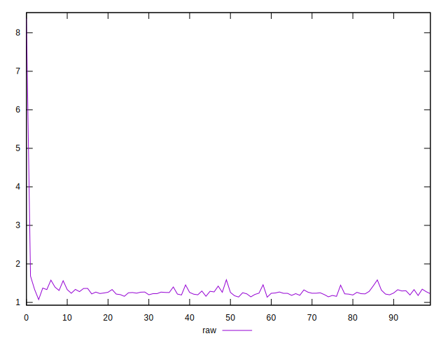
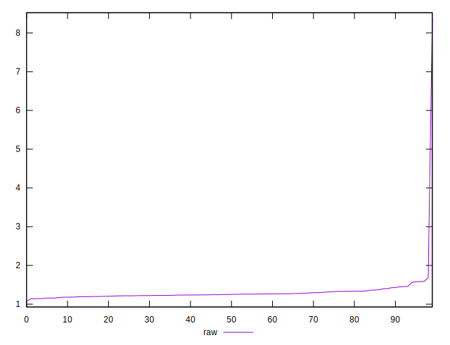
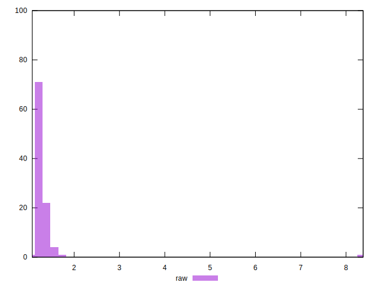
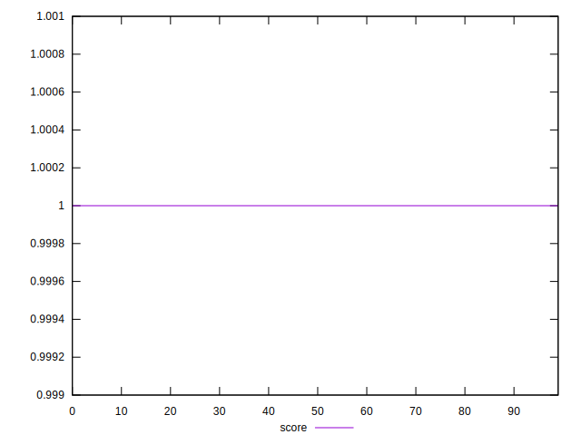

# //server-response-time/samples/empty

[→ Parent](../..)


## Raw


```yaml
p90min: 1.0739999999999998
p90max: 1.424
p90range: 0.3500000000000001
p90mean: 1.2498666666666665
p90median: 1.2425000000000002
p90stdev: 0.0638014628881397
p90skewness: 0.3124766650682895
p90eccentricity: 0.999999999999999
p90discretization: 1.1538461538461537
outlandishness: 1.1606419010560332

```


## Score


```yaml
p90min: 1
p90max: 1
p90range: 0
p90mean: 1
p90median: 1
p90stdev: 0
p90skewness: .nan
p90eccentricity: .nan
p90discretization: 90
outlandishness: 1

```

