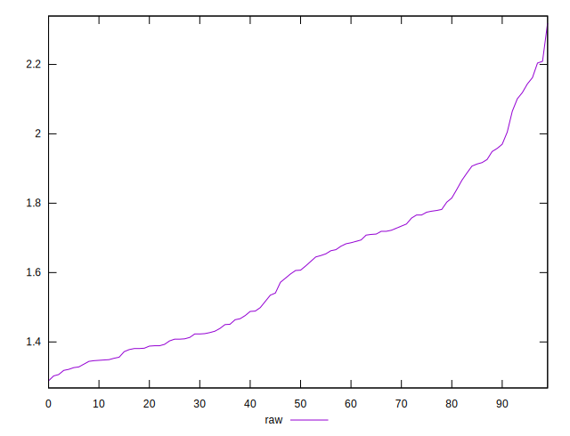

# //server-response-time/samples/pages+cached+noadtech

[→ Parent](../..)


## Raw


```yaml
p90min: 1.288
p90max: 1.9580000000000002
p90range: 0.6700000000000002
p90mean: 1.5666777777777778
p90median: 1.5379999999999998
p90stdev: 0.19036356022550222
p90skewness: 0.3263453277077126
p90eccentricity: 1
p90discretization: 1.0227272727272727
outlandishness: 1.0731793841934743

```


## Score


```yaml
p90min: 1
p90max: 1
p90range: 0
p90mean: 1
p90median: 1
p90stdev: 0
p90skewness: .nan
p90eccentricity: .nan
p90discretization: 90
outlandishness: 1

```

