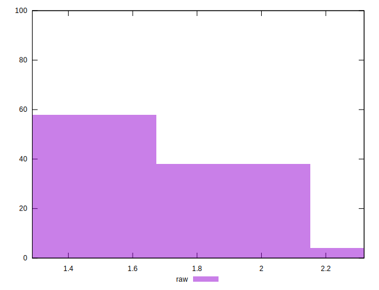

# //server-response-time/samples/pages+cached+noadtech

[→ Parent](../..)


## Raw


```yaml
p90min: 1.288
p90max: 1.9700000000000002
p90range: 0.6820000000000002
p90mean: 1.5711098901098892
p90median: 1.541
p90stdev: 0.19392779048956277
p90skewness: 0.3355669377242012
p90eccentricity: 1.0000000000000002
p90discretization: 1.0224719101123596
outlandishness: 1.067133031075797

```


## Score


```yaml
p90min: 1
p90max: 1
p90range: 0
p90mean: 1
p90median: 1
p90stdev: 0
p90skewness: .nan
p90eccentricity: .nan
p90discretization: 91
outlandishness: 1

```

