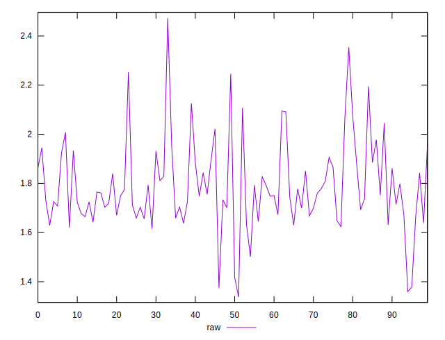

# //server-response-time/samples/pages+cached+noexternal+nocss

[→ Parent](../..)


## Raw


```yaml
p90min: 1.417
p90max: 2.1260000000000003
p90range: 0.7090000000000003
p90mean: 1.7806813186813193
p90median: 1.7500000000000002
p90stdev: 0.139100712910923
p90skewness: 0.5827804494246764
p90eccentricity: 0.9999999999999996
p90discretization: 1.011111111111111
outlandishness: 1.0106518810364478

```


## Score


```yaml
p90min: 1
p90max: 1
p90range: 0
p90mean: 1
p90median: 1
p90stdev: 0
p90skewness: .nan
p90eccentricity: .nan
p90discretization: 91
outlandishness: 1

```

