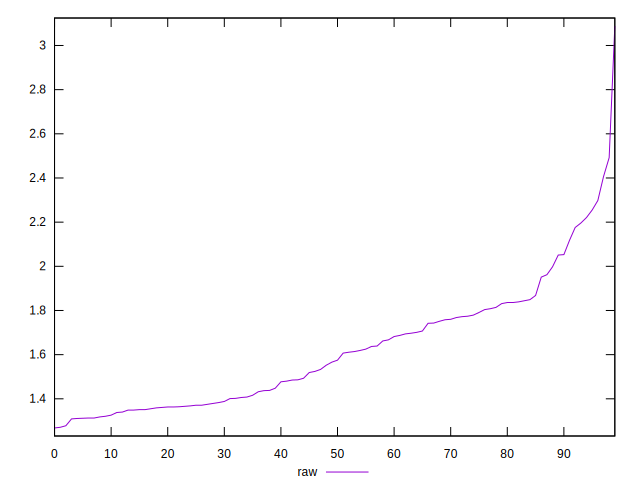

# //server-response-time/samples/pages+cached+noexternal+nofonts+nosvg+noimg+nocss+nojs

[→ Parent](../..)


## Raw


```yaml
p90min: 1.268
p90max: 2.053
p90range: 0.7849999999999999
p90mean: 1.5592637362637363
p90median: 1.519
p90stdev: 0.21064692792770795
p90skewness: 0.4629039162868985
p90eccentricity: 1.0000000000000002
p90discretization: 1.0705882352941176
outlandishness: 1.0947065864943248

```


## Score


```yaml
p90min: 1
p90max: 1
p90range: 0
p90mean: 1
p90median: 1
p90stdev: 0
p90skewness: .nan
p90eccentricity: .nan
p90discretization: 91
outlandishness: 1

```

