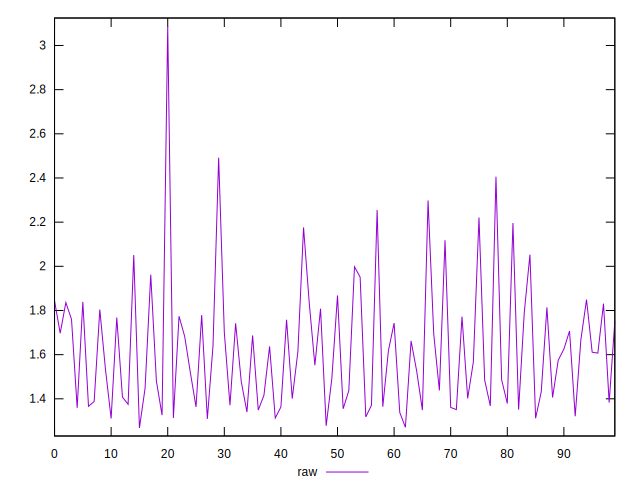

# //server-response-time/samples/pages+cached+noexternal+nofonts+nosvg+noimg+nocss+nojs

[→ Parent](../..)


## Raw


```yaml
p90min: 1.268
p90max: 2.051
p90range: 0.7830000000000001
p90mean: 1.5537777777777775
p90median: 1.506
p90stdev: 0.20524726430862078
p90skewness: 0.43150108304066037
p90eccentricity: 0.9999999999999996
p90discretization: 1.0714285714285714
outlandishness: 1.1024504439207283

```


## Score


```yaml
p90min: 1
p90max: 1
p90range: 0
p90mean: 1
p90median: 1
p90stdev: 0
p90skewness: .nan
p90eccentricity: .nan
p90discretization: 90
outlandishness: 1

```

