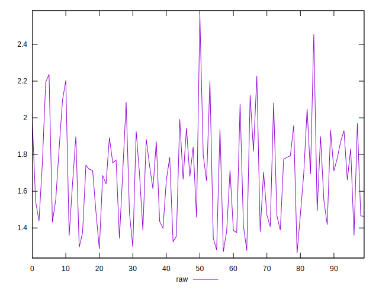
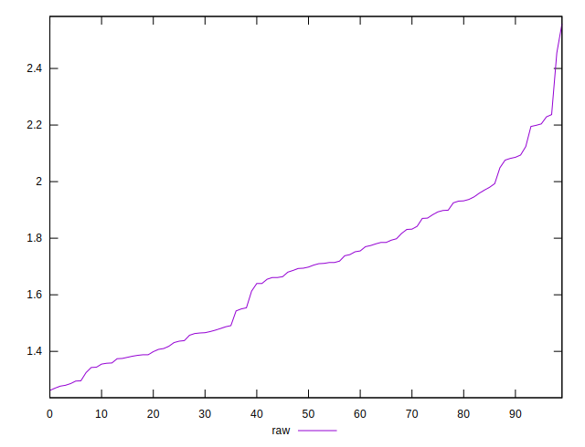

# //server-response-time/samples/pages+cached+noexternal+nofonts+nosvg+noimg+nocss

[→ Parent](../..)


## Raw


```yaml
p90min: 1.262
p90max: 2.082
p90range: 0.8199999999999998
p90mean: 1.6301111111111106
p90median: 1.6625
p90stdev: 0.2279634202841638
p90skewness: 0.07922538516924589
p90eccentricity: 1
p90discretization: 1.0465116279069768
outlandishness: 1.075985874071979

```


## Score


```yaml
p90min: 1
p90max: 1
p90range: 0
p90mean: 1
p90median: 1
p90stdev: 0
p90skewness: .nan
p90eccentricity: .nan
p90discretization: 90
outlandishness: 1

```

