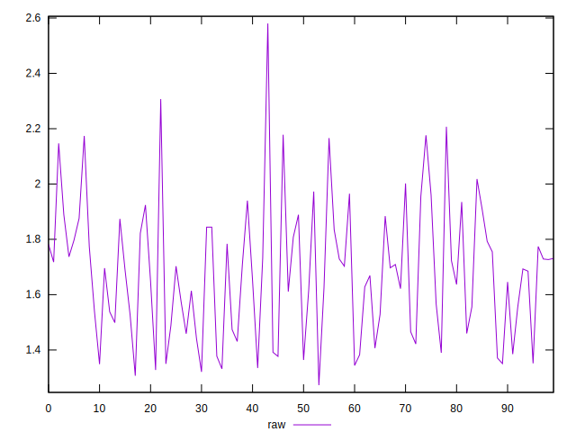
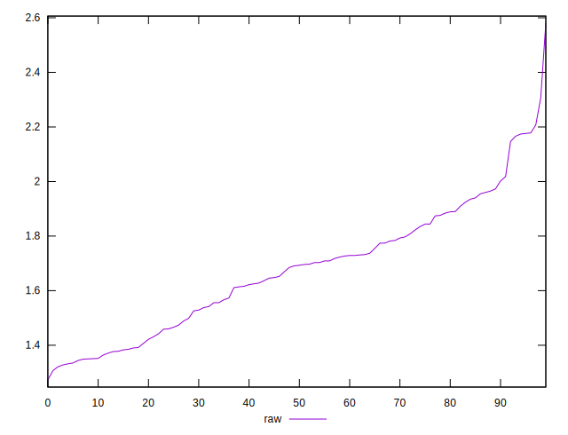
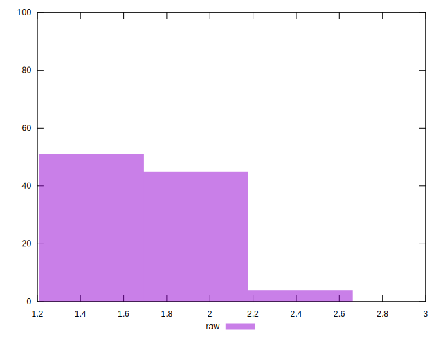

# //server-response-time/samples/pages+cached+noexternal+nofonts+nosvg+noimg

[→ Parent](../..)


## Raw


```yaml
p90min: 1.307
p90max: 2.018
p90range: 0.7109999999999999
p90mean: 1.6377032967032965
p90median: 1.6519999999999997
p90stdev: 0.19934830606751813
p90skewness: -0.007594998581550409
p90eccentricity: 0.9999999999999993
p90discretization: 1.0705882352941176
outlandishness: 1.055316941229559

```


## Score


```yaml
p90min: 1
p90max: 1
p90range: 0
p90mean: 1
p90median: 1
p90stdev: 0
p90skewness: .nan
p90eccentricity: .nan
p90discretization: 91
outlandishness: 1

```

