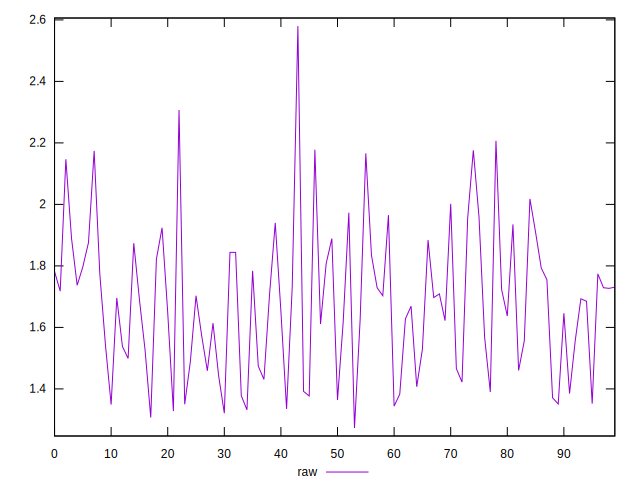
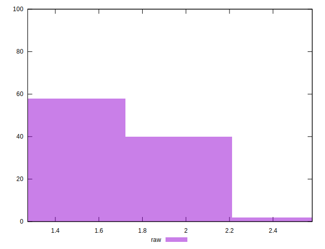

# //server-response-time/samples/pages+cached+noexternal+nofonts+nosvg+noimg

[→ Parent](../..)


## Raw


```yaml
p90min: 1.273
p90max: 1.9729999999999999
p90range: 0.7
p90mean: 1.625377777777778
p90median: 1.6470000000000002
p90stdev: 0.1960248044269329
p90skewness: -0.043200101558784294
p90eccentricity: 1
p90discretization: 1.0714285714285714
outlandishness: 1.0713829260301595

```


## Score


```yaml
p90min: 1
p90max: 1
p90range: 0
p90mean: 1
p90median: 1
p90stdev: 0
p90skewness: .nan
p90eccentricity: .nan
p90discretization: 90
outlandishness: 1

```

