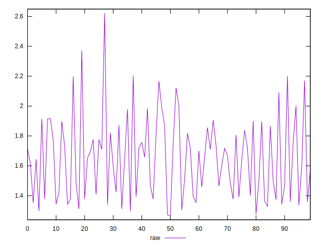

# //server-response-time/samples/pages+cached+noexternal+nofonts

[→ Parent](../..)


## Raw


```yaml
p90min: 1.266
p90max: 2.0010000000000003
p90range: 0.7350000000000003
p90mean: 1.5981098901098905
p90median: 1.6169999999999998
p90stdev: 0.22059636704835597
p90skewness: 0.15112085682964213
p90eccentricity: 0.9999999999999993
p90discretization: 1.058139534883721
outlandishness: 1.0734491956633718

```


## Score


```yaml
p90min: 1
p90max: 1
p90range: 0
p90mean: 1
p90median: 1
p90stdev: 0
p90skewness: .nan
p90eccentricity: .nan
p90discretization: 91
outlandishness: 1

```

