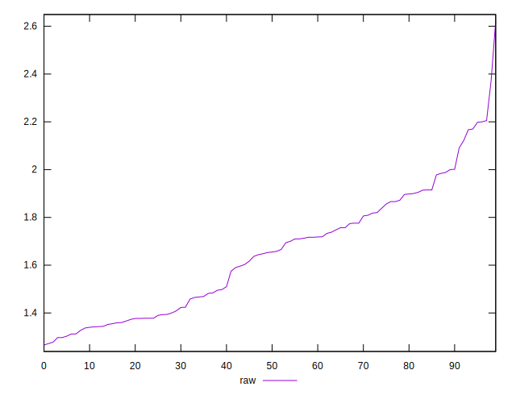
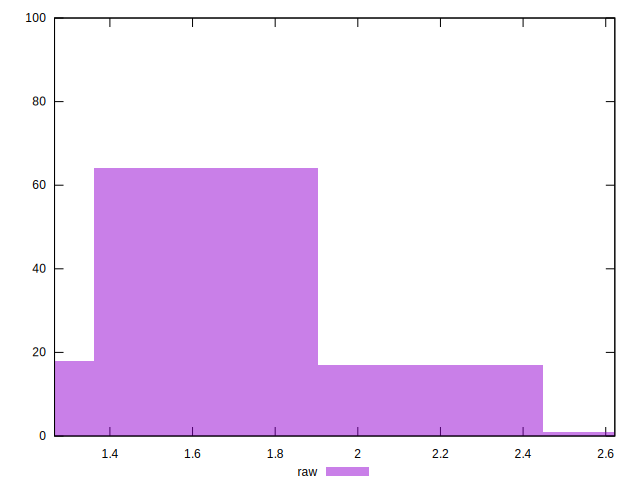

# //server-response-time/samples/pages+cached+noexternal+nofonts

[→ Parent](../..)


## Raw


```yaml
p90min: 1.266
p90max: 2
p90range: 0.734
p90mean: 1.593633333333333
p90median: 1.6099999999999999
p90stdev: 0.21766913985322872
p90skewness: 0.15029675091033434
p90eccentricity: 1
p90discretization: 1.0588235294117647
outlandishness: 1.0794883583174082

```


## Score


```yaml
p90min: 1
p90max: 1
p90range: 0
p90mean: 1
p90median: 1
p90stdev: 0
p90skewness: .nan
p90eccentricity: .nan
p90discretization: 90
outlandishness: 1

```

