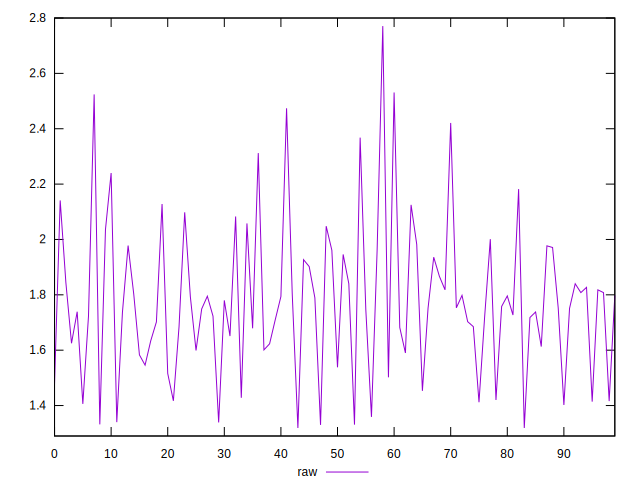

# //server-response-time/samples/pages+cached+noexternal+noimg

[→ Parent](../..)


## Raw


```yaml
p90min: 1.3299999999999998
p90max: 2.2399999999999998
p90range: 0.9099999999999999
p90mean: 1.7355384615384615
p90median: 1.749
p90stdev: 0.2196936582283726
p90skewness: -0.016118295882562243
p90eccentricity: 1.0000000000000002
p90discretization: 1.0705882352941176
outlandishness: 1.0515738002326176

```


## Score


```yaml
p90min: 1
p90max: 1
p90range: 0
p90mean: 1
p90median: 1
p90stdev: 0
p90skewness: .nan
p90eccentricity: .nan
p90discretization: 91
outlandishness: 1

```

