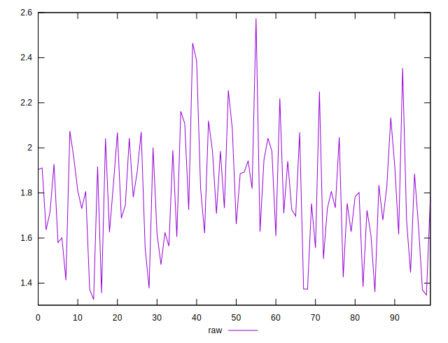
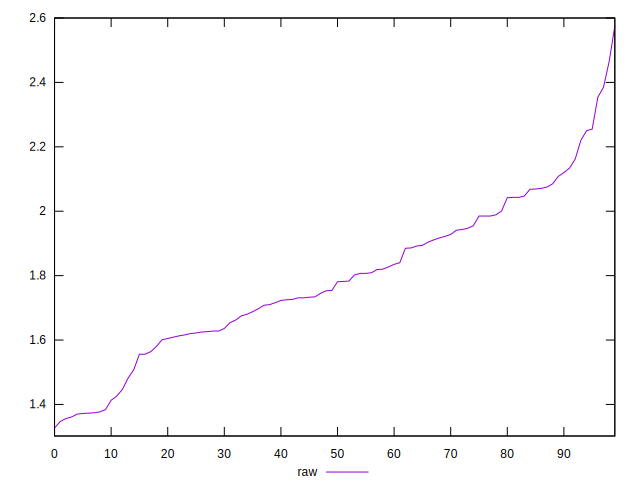
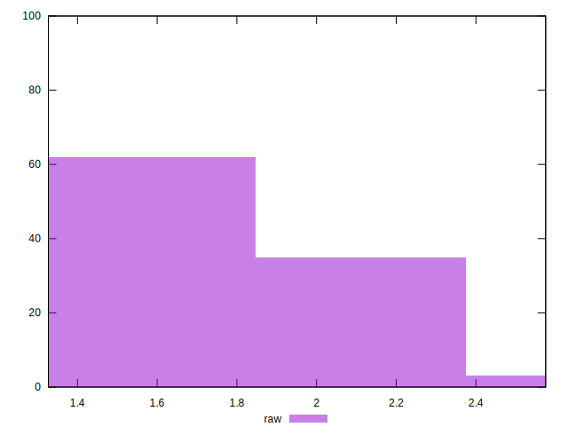

# //server-response-time/samples/pages+cached+noexternal+nosvg

[→ Parent](../..)


## Raw


```yaml
p90min: 1.327
p90max: 2.108
p90range: 0.7810000000000001
p90mean: 1.7375555555555557
p90median: 1.7319999999999998
p90stdev: 0.21099463453478892
p90skewness: -0.1948896546798416
p90eccentricity: 0.9999999999999999
p90discretization: 1.0588235294117647
outlandishness: 1.0648371157575716

```


## Score


```yaml
p90min: 1
p90max: 1
p90range: 0
p90mean: 1
p90median: 1
p90stdev: 0
p90skewness: .nan
p90eccentricity: .nan
p90discretization: 90
outlandishness: 1

```

