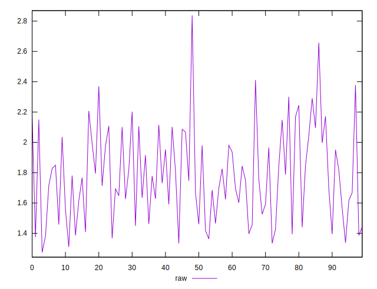
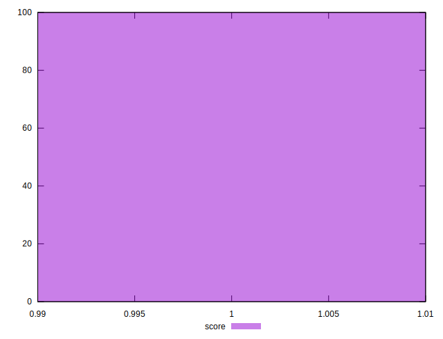

# //server-response-time/samples/pages+cached+noexternal

[→ Parent](../..)


## Raw


```yaml
p90min: 1.274
p90max: 2.178
p90range: 0.9039999999999999
p90mean: 1.7185999999999995
p90median: 1.705
p90stdev: 0.25738124769816983
p90skewness: 0.1229376663489757
p90eccentricity: 1
p90discretization: 1.0227272727272727
outlandishness: 1.0796474780439445

```


## Score


```yaml
p90min: 1
p90max: 1
p90range: 0
p90mean: 1
p90median: 1
p90stdev: 0
p90skewness: .nan
p90eccentricity: .nan
p90discretization: 90
outlandishness: 1

```

