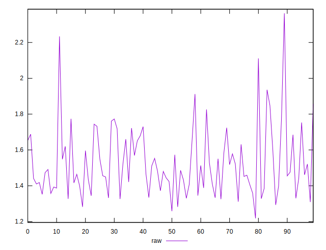
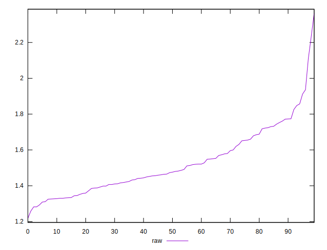
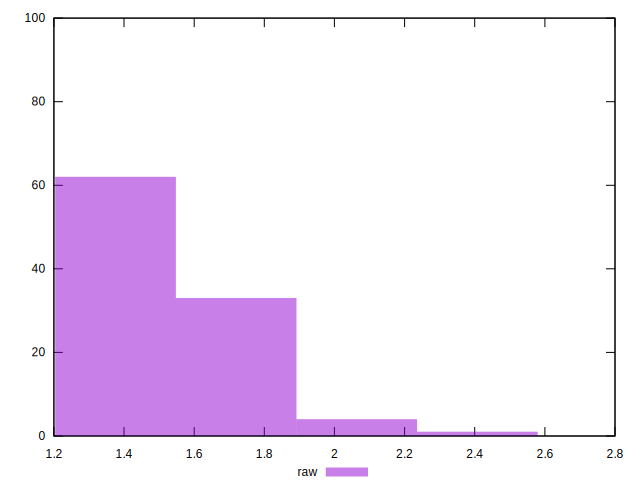

# //server-response-time/samples/pages+cached+nointeractive

[→ Parent](../..)


## Raw


```yaml
p90min: 1.218
p90max: 1.772
p90range: 0.554
p90mean: 1.4817666666666667
p90median: 1.4575
p90stdev: 0.1364569162776296
p90skewness: 0.44530955186978266
p90eccentricity: 0.9999999999999996
p90discretization: 1.0588235294117647
outlandishness: 1.0660644955224352

```


## Score


```yaml
p90min: 1
p90max: 1
p90range: 0
p90mean: 1
p90median: 1
p90stdev: 0
p90skewness: .nan
p90eccentricity: .nan
p90discretization: 90
outlandishness: 1

```

