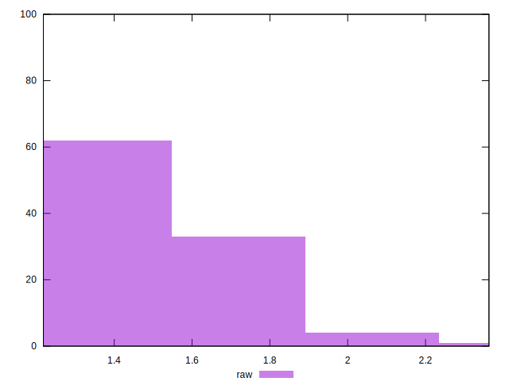

# //server-response-time/samples/pages+cached+nointeractive

[→ Parent](../..)


## Raw


```yaml
p90min: 1.258
p90max: 1.774
p90range: 0.516
p90mean: 1.4910769230769236
p90median: 1.461
p90stdev: 0.13941007821178522
p90skewness: 0.488200716474944
p90eccentricity: 1.0000000000000002
p90discretization: 1.058139534883721
outlandishness: 1.0527930849724236

```


## Score


```yaml
p90min: 1
p90max: 1
p90range: 0
p90mean: 1
p90median: 1
p90stdev: 0
p90skewness: .nan
p90eccentricity: .nan
p90discretization: 91
outlandishness: 1

```

