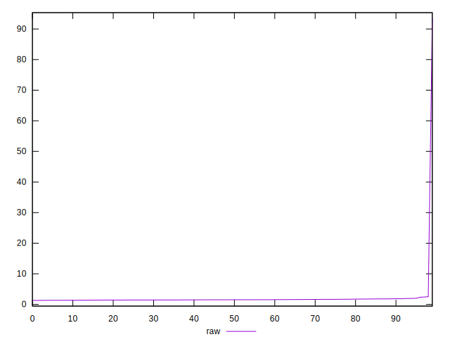

# //server-response-time/samples/pages+cached

[→ Parent](../..)


## Raw


```yaml
p90min: 1.296
p90max: 1.835
p90range: 0.5389999999999999
p90mean: 1.5242666666666675
p90median: 1.5055
p90stdev: 0.1301576650750073
p90skewness: 0.5721594868110775
p90eccentricity: 0.9999999999999997
p90discretization: 1.0465116279069768
outlandishness: 2.6793511746154373

```


## Score


```yaml
p90min: 1
p90max: 1
p90range: 0
p90mean: 1
p90median: 1
p90stdev: 0
p90skewness: .nan
p90eccentricity: .nan
p90discretization: 90
outlandishness: 1

```

