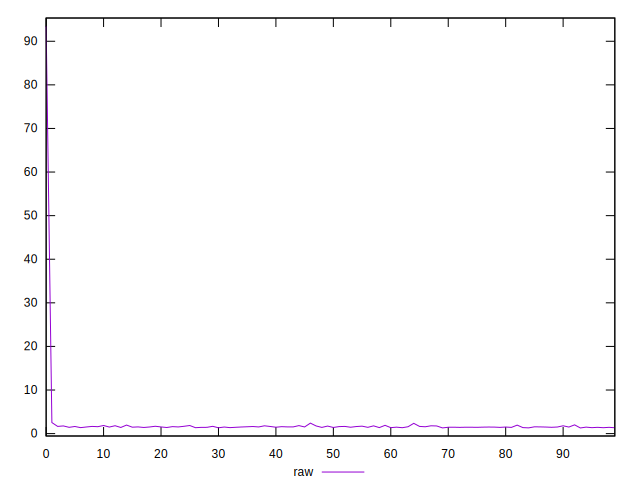
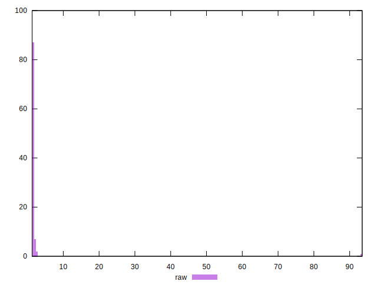

# //server-response-time/samples/pages+cached

[→ Parent](../..)


## Raw


```yaml
p90min: 1.366
p90max: 2.5340000000000003
p90range: 1.1680000000000001
p90mean: 1.5970989010989005
p90median: 1.528
p90stdev: 0.2150572658182234
p90skewness: 2.107890889904001
p90eccentricity: 0.9999999999999999
p90discretization: 1.0459770114942528
outlandishness: 2.4405511943546903

```


## Score


```yaml
p90min: 1
p90max: 1
p90range: 0
p90mean: 1
p90median: 1
p90stdev: 0
p90skewness: .nan
p90eccentricity: .nan
p90discretization: 91
outlandishness: 1

```

