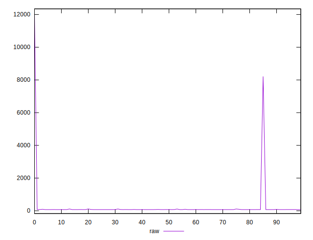
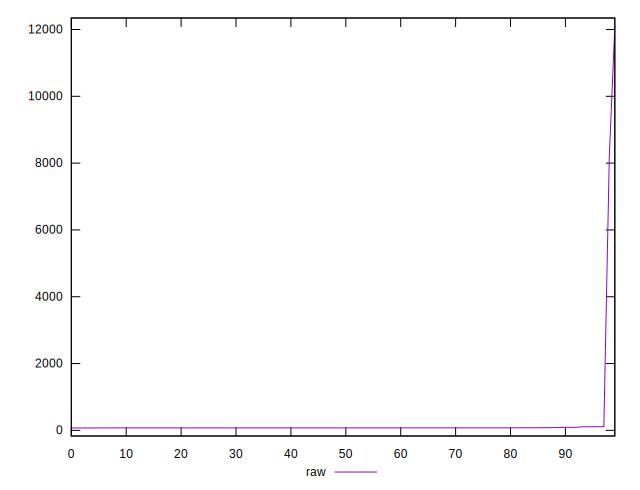
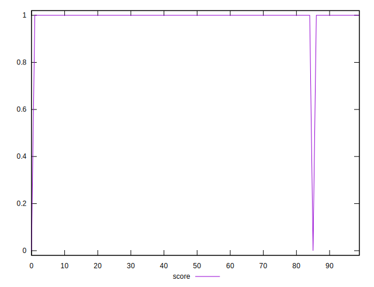
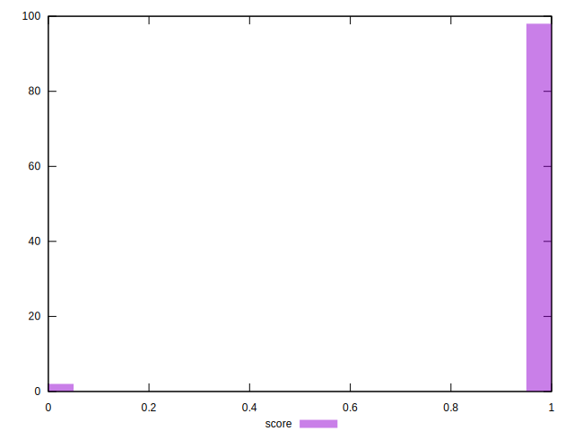

# //server-response-time/samples/pages

[→ Parent](../..)


## Raw


```yaml
p90min: 72.68499999999999
p90max: 111.77499999999999
p90range: 39.09
p90mean: 77.16384615384614
p90median: 74.264
p90stdev: 8.460693476790155
p90skewness: 3.017157161776073
p90eccentricity: 1.0000000000000002
p90discretization: 1.011111111111111
outlandishness: 13.019025906084183

```


## Score


```yaml
p90min: 1
p90max: 1
p90range: 0
p90mean: 1
p90median: 1
p90stdev: 0
p90skewness: .nan
p90eccentricity: .nan
p90discretization: 91
outlandishness: 0.9603999999999999

```

