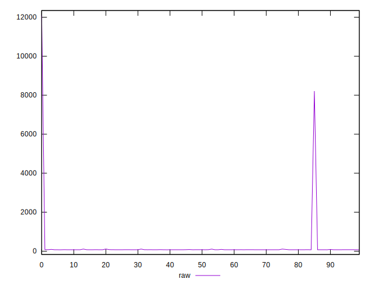
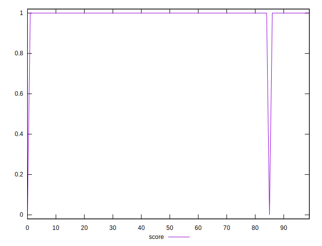

# //server-response-time/samples/pages

[→ Parent](../..)


## Raw


```yaml
p90min: 71.747
p90max: 89.887
p90range: 18.14
p90mean: 74.56389999999998
p90median: 74.0055
p90stdev: 2.3715225397762225
p90skewness: 3.7272145227709257
p90eccentricity: 1.0000000000000002
p90discretization: 1.0112359550561798
outlandishness: 13.942767758282292

```


## Score


```yaml
p90min: 0
p90max: 1
p90range: 1
p90mean: 0.9777777777777777
p90median: 1
p90stdev: 0.14740554623801777
p90skewness: -6.482493908421965
p90eccentricity: 0.9999999999999937
p90discretization: 45
outlandishness: 1.0045506198347105

```

