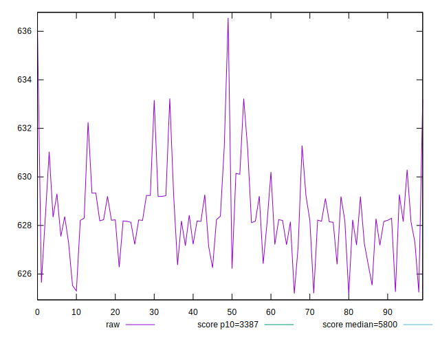
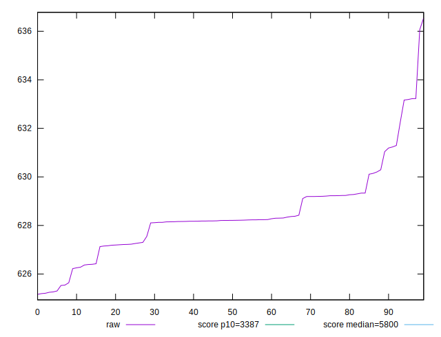
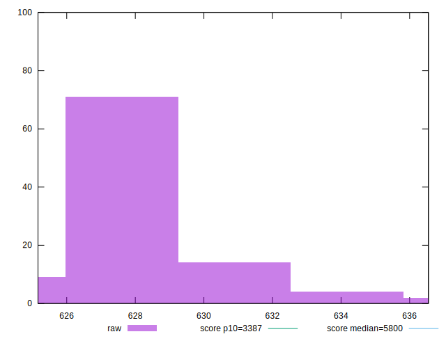
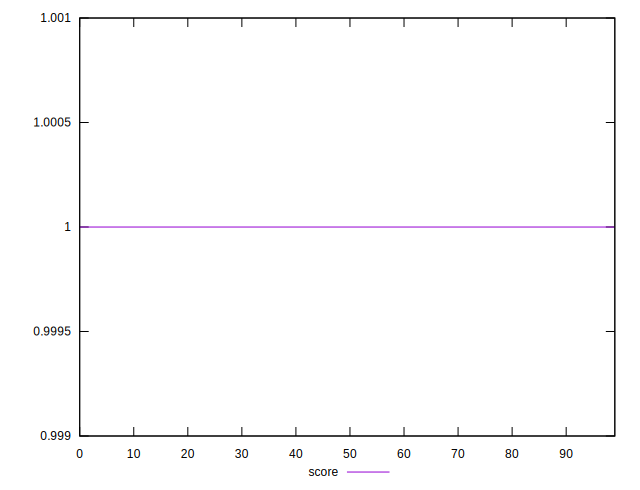

# //speed-index/samples/empty

[→ Parent](../..)


## Raw


```yaml
p90min: 625.20675
p90max: 631.29395
p90range: 6.087199999999939
p90mean: 628.121121978022
p90median: 628.20435
p90stdev: 1.3320611023920694
p90skewness: -0.08782431916081142
p90eccentricity: 1
p90discretization: 1
outlandishness: 1.0011125661661102

```


## Score


```yaml
p90min: 0.9999999366375946
p90max: 0.999999944155025
p90range: 7.517430455905583e-9
p90mean: 0.9999999406411408
p90median: 0.9999999405587603
p90stdev: 1.6393376499562578e-9
p90skewness: 0.004041434027677047
p90eccentricity: 0.9999999999999313
p90discretization: 1
outlandishness: 0.9999999990793758

```

