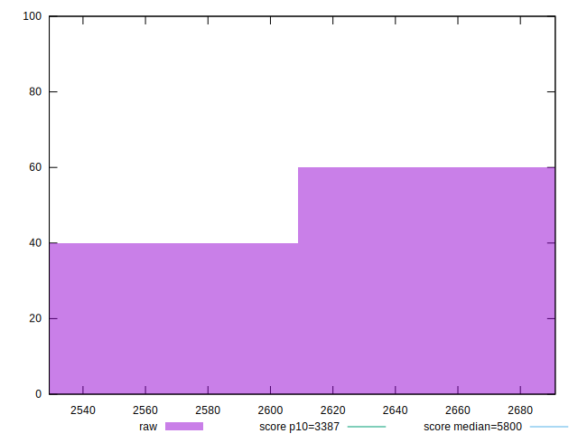
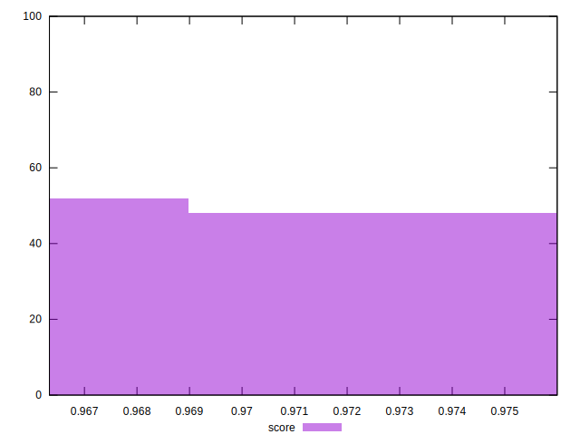

# //speed-index/samples/pages+cached+noadtech

[→ Parent](../..)


## Raw


```yaml
p90min: 2545.631469663684
p90max: 2691.1665947842575
p90range: 145.5351251205734
p90mean: 2632.162388284272
p90median: 2653.320752580391
p90stdev: 49.18895260750582
p90skewness: -0.5872140476687365
p90eccentricity: 0.9999999999999999
p90discretization: 1
outlandishness: 0.9935024787922319

```


## Score


```yaml
p90min: 0.9663334272595616
p90max: 0.9751128794939397
p90range: 0.008779452234378038
p90mean: 0.9700016751993646
p90median: 0.9687819585442787
p90stdev: 0.0029646450097870467
p90skewness: 0.558951303025862
p90eccentricity: 1.0000000000000007
p90discretization: 1
outlandishness: 1.0010353192346937

```


## P Score


```yaml
p90min: 0.9663334272595616
p90max: 0.9751128794939397
p90range: 0.008779452234378038
p90mean: 0.9700016751993646
p90median: 0.9687819585442787
p90stdev: 0.0029646450097870467
p90skewness: 0.558951303025862
p90eccentricity: 1.0000000000000007
p90discretization: 1
outlandishness: 1.0010353192346937

```


## Score Difference


```yaml
p90min: -0.004171229285777289
p90max: 0.004987123686327477
p90range: 0.009158352972104766
p90mean: 0.0012124679675081758
p90median: 0.0018587951540292025
p90stdev: 0.0026808307212637266
p90skewness: -0.8522831400885089
p90eccentricity: 1.0000000000000007
p90discretization: 1
outlandishness: 0.3298239477823399

```


## P Score Difference


```yaml
p90min: 0
p90max: 0
p90range: 0
p90mean: 0
p90median: 0
p90stdev: 0
p90skewness: .nan
p90eccentricity: .nan
p90discretization: 91
outlandishness: .nan

```

