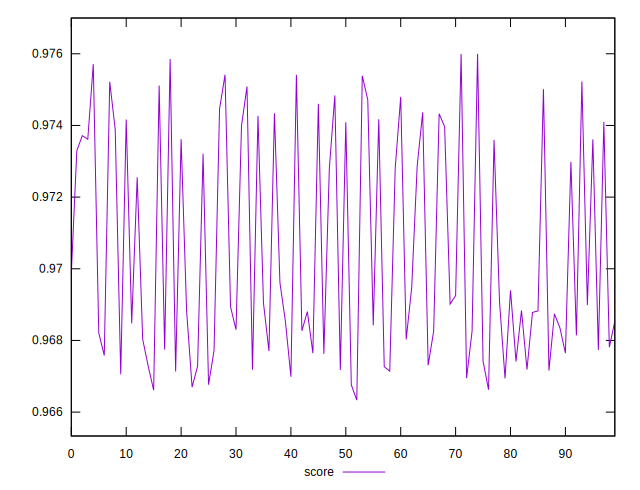
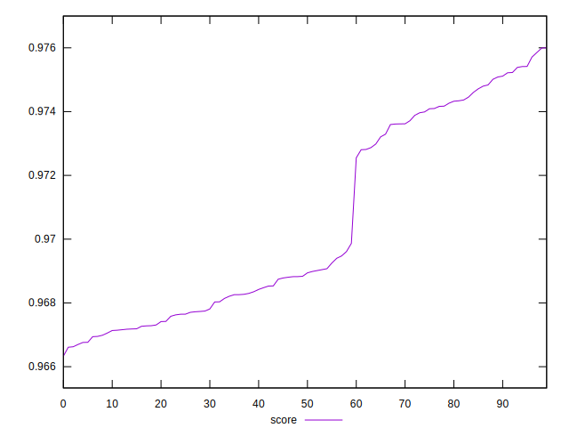

# //speed-index/samples/pages+cached+noadtech

[→ Parent](../..)


## Raw


```yaml
p90min: 2529.1971479163985
p90max: 2678.9777804114156
p90range: 149.78063249501702
p90mean: 2616.8297899318945
p90median: 2647.2686277553767
p90stdev: 53.05253635283012
p90skewness: -0.27302567316616794
p90eccentricity: 0.9999999999999997
p90discretization: 1
outlandishness: 1.0051788982916943

```


## Score


```yaml
p90min: 0.9663334272595616
p90max: 0.9750854968538237
p90range: 0.008752069594262113
p90mean: 0.9699448840405357
p90median: 0.9687622867446899
p90stdev: 0.0029314297659508576
p90skewness: 0.5838219204581847
p90eccentricity: 0.9999999999999996
p90discretization: 1
outlandishness: 1.0011525457308628

```

