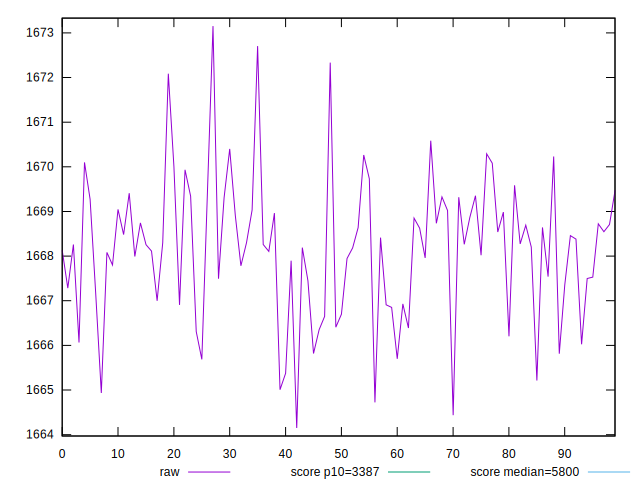
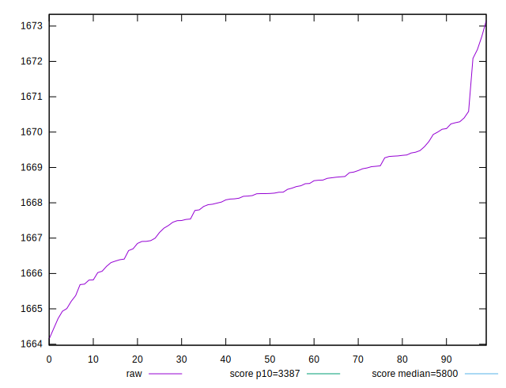
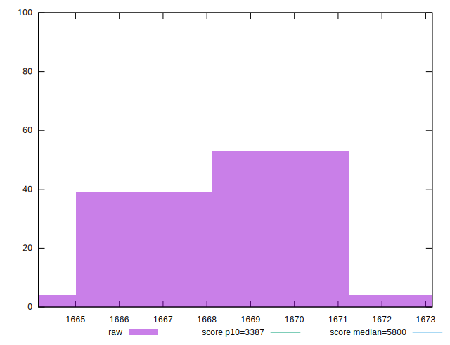
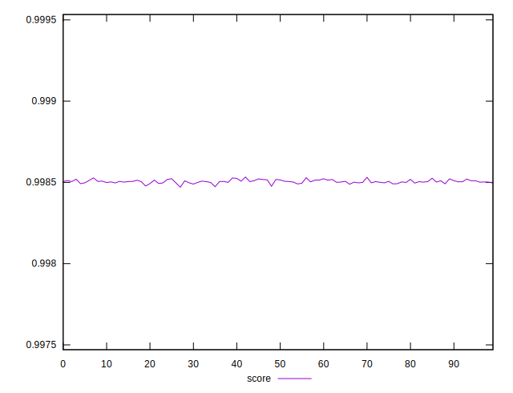
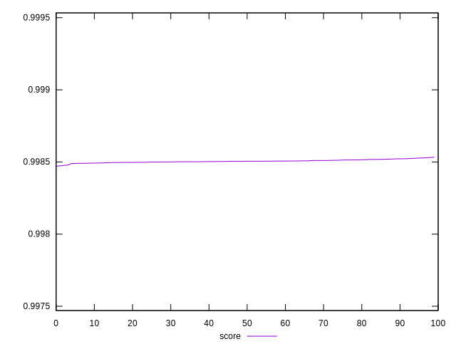
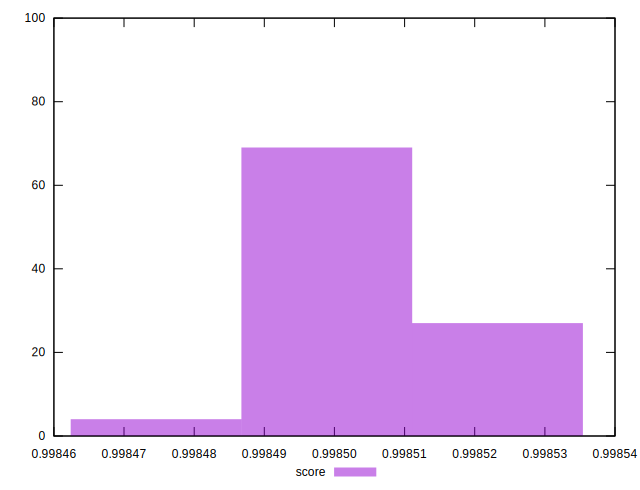

# //speed-index/samples/pages+cached+noexternal+nocss

[→ Parent](../..)


## Raw


```yaml
p90min: 1664.1504999999997
p90max: 1670.0817999999997
p90range: 5.931299999999965
p90mean: 1667.819527777778
p90median: 1668.1874000000003
p90stdev: 1.3742395769643214
p90skewness: -0.7281443714673721
p90eccentricity: 1.0000000000000009
p90discretization: 1
outlandishness: 1.0004071612917225

```


## Score


```yaml
p90min: 0.9984704063097833
p90max: 0.9985215874445386
p90range: 0.00005118113475521824
p90mean: 0.9985030103632664
p90median: 0.9985037408962181
p90stdev: 0.000009858732725652565
p90skewness: -0.7672845050436371
p90eccentricity: 1
p90discretization: 1
outlandishness: 1.0000047042987548

```

