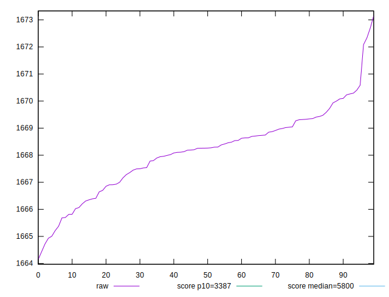
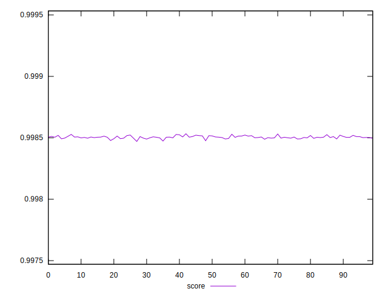
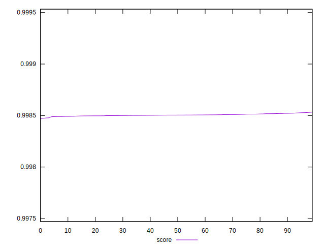

# //speed-index/samples/pages+cached+noexternal+nocss

[→ Parent](../..)


## Raw


```yaml
p90min: 1665.2136999999998
p90max: 1670.5841999999998
p90range: 5.370499999999993
p90mean: 1668.1580043956042
p90median: 1668.2639
p90stdev: 1.267550657106961
p90skewness: -0.34557371829790234
p90eccentricity: 1
p90discretization: 1
outlandishness: 1.0000012284264546

```


## Score


```yaml
p90min: 0.9984884756206518
p90max: 0.9985257439353907
p90range: 0.000037268314738936326
p90mean: 0.998505382055854
p90median: 0.9985046666780728
p90stdev: 0.000008797375557399148
p90skewness: 0.335886488793201
p90eccentricity: 0.9999999999999999
p90discretization: 1
outlandishness: 0.9999999537967127

```

