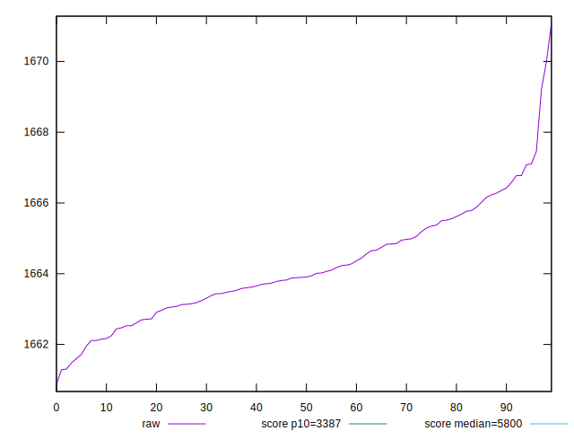
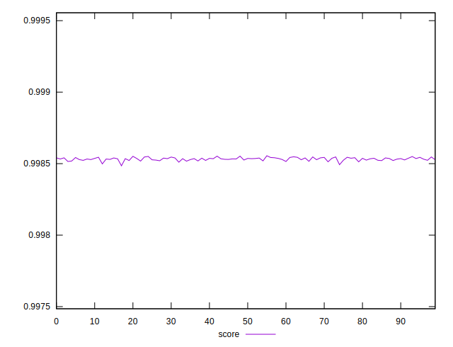
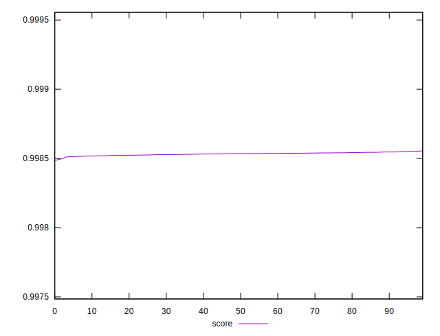
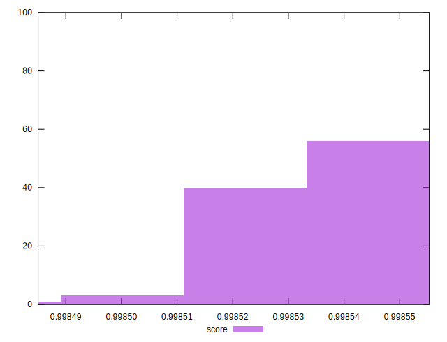

# //speed-index/samples/pages+cached+noexternal+nofonts+nosvg+noimg+nocss

[→ Parent](../..)


## Raw


```yaml
p90min: 1660.8732000000005
p90max: 1666.3543
p90range: 5.481099999999515
p90mean: 1663.8410633333335
p90median: 1663.79365
p90stdev: 1.2914146229318615
p90skewness: -0.025200274567519554
p90eccentricity: 0.9999999999999999
p90discretization: 1
outlandishness: 1.000481602363314

```


## Score


```yaml
p90min: 0.9984850227647251
p90max: 0.9985465720162521
p90range: 0.00006154925152701551
p90mean: 0.9985304118118252
p90median: 0.9985335059904928
p90stdev: 0.000011307192610007357
p90skewness: -1.4048407640189227
p90eccentricity: 0.9999999999999997
p90discretization: 1
outlandishness: 1.0000039254859059

```

