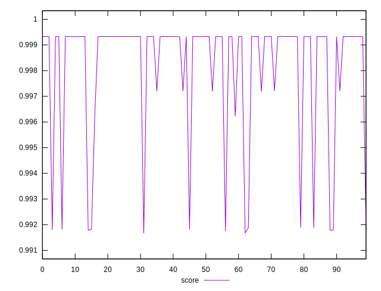
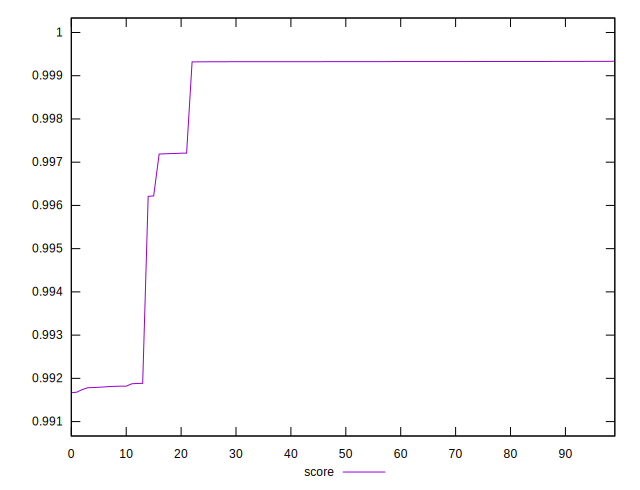

# //speed-index/samples/pages+cached+noexternal+nofonts+nosvg+noimg

[→ Parent](../..)


## Raw


```yaml
p90min: 1508.0034
p90max: 2117.36695
p90range: 609.36355
p90mean: 1565.7342738888885
p90median: 1510.33555
p90stdev: 150.12451475873164
p90skewness: 2.663027181166777
p90eccentricity: 0.9999999999999999
p90discretization: 1
outlandishness: 1.0719631432671546

```


## Score


```yaml
p90min: 0.9916665889753722
p90max: 0.9993298042263086
p90range: 0.007663215250936384
p90mean: 0.9979439506947935
p90median: 0.999324609232435
p90stdev: 0.0027248237231099486
p90skewness: -1.6948042086768444
p90eccentricity: 0.9999999999999999
p90discretization: 1
outlandishness: 1.0002781194034236

```

