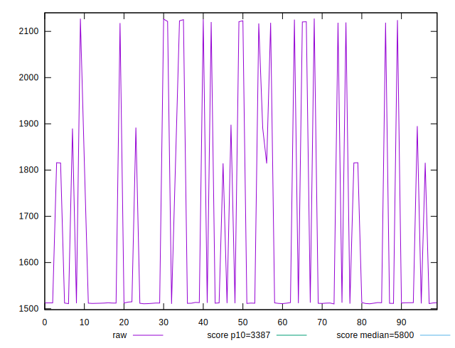
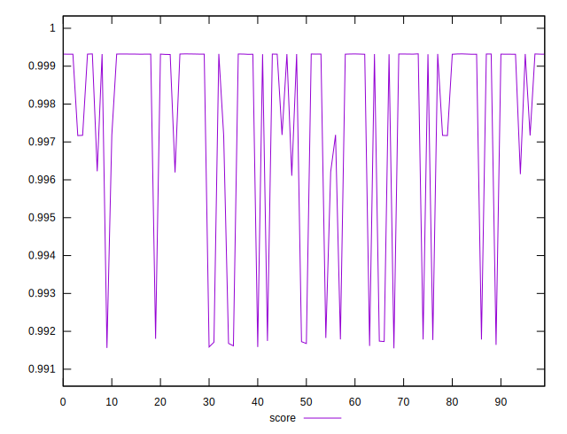
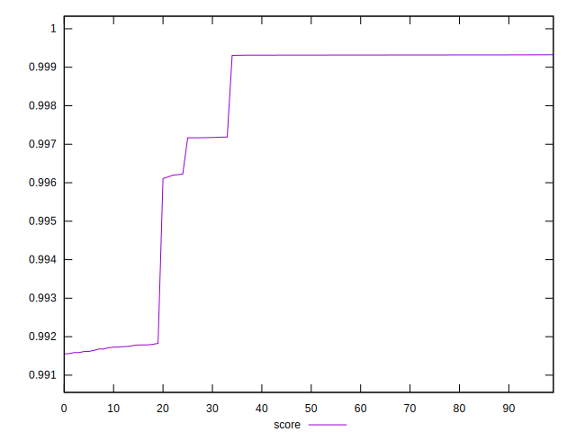
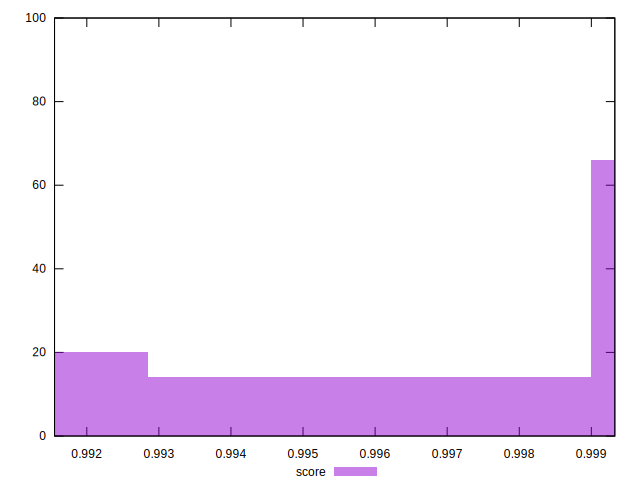

# //speed-index/samples/pages+cached+noexternal+nofonts

[→ Parent](../..)


## Raw


```yaml
p90min: 1510.4286000000002
p90max: 2121.58605
p90range: 611.1574499999997
p90mean: 1636.5479159340653
p90median: 1512.6099999999997
p90stdev: 214.9186381226493
p90skewness: 1.3820440854927267
p90eccentricity: 0.9999999999999999
p90discretization: 1
outlandishness: 1.0545006188147241

```


## Score


```yaml
p90min: 0.9917128118411545
p90max: 0.9993257996549971
p90range: 0.007612987813842675
p90mean: 0.998021266865594
p90median: 0.9993177008809642
p90stdev: 0.0024921832996294925
p90skewness: -1.8361961998079868
p90eccentricity: 1.0000000000000002
p90discretization: 1
outlandishness: 0.9988445895962037

```

