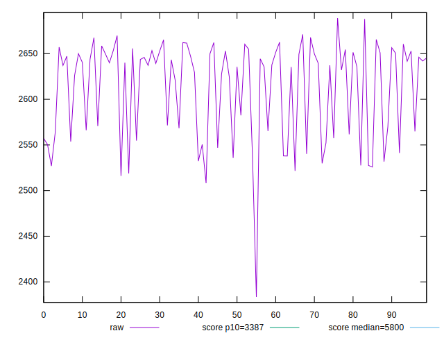
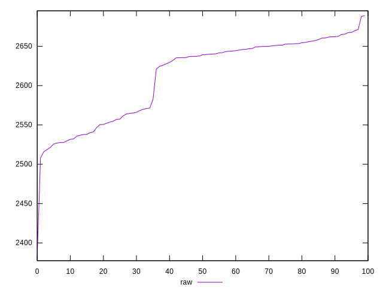
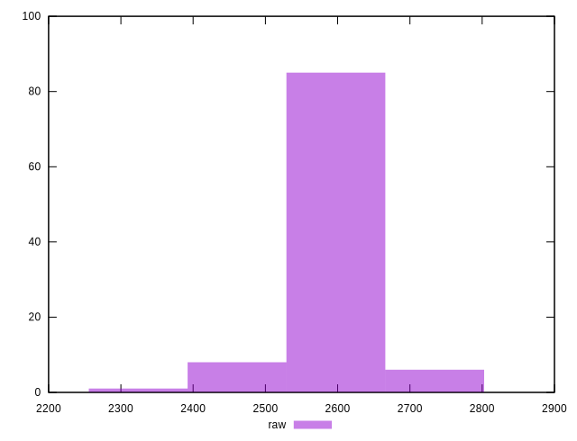
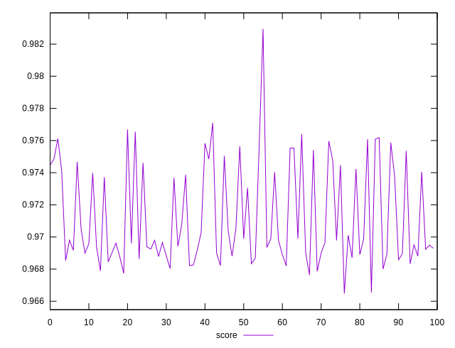
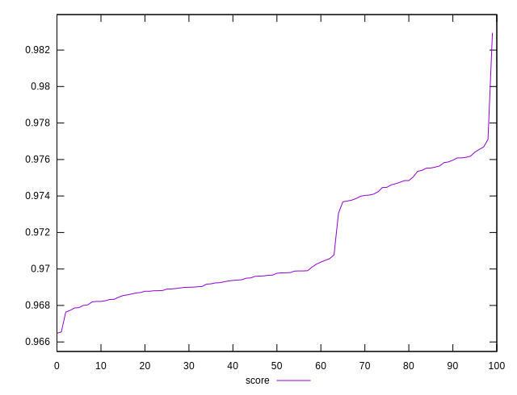
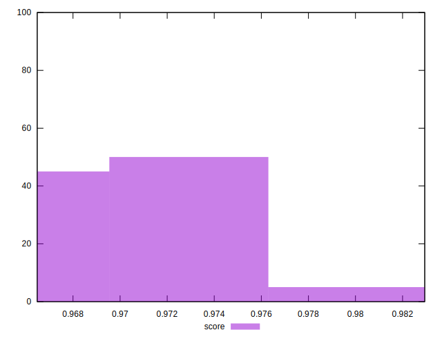

# //speed-index/samples/pages+cached+noexternal+noimg

[→ Parent](../..)


## Raw


```yaml
p90min: 2529.8411606591517
p90max: 2688.970618200059
p90range: 159.12945754090742
p90mean: 2620.662740571605
p90median: 2640.39474474106
p90stdev: 46.03489208173923
p90skewness: -0.7789257100015797
p90eccentricity: 0.9999999999999993
p90discretization: 1
outlandishness: 0.9921539611142798

```


## Score


```yaml
p90min: 0.9665463251687385
p90max: 0.9760846858082897
p90range: 0.009538360639551158
p90mean: 0.9708207209504769
p90median: 0.9696084074246614
p90stdev: 0.0027389519133689754
p90skewness: 0.7290728348853113
p90eccentricity: 1.0000000000000007
p90discretization: 1
outlandishness: 1.0009717326757994

```


## P Score


```yaml
p90min: 0.9665463251687385
p90max: 0.9760846858082897
p90range: 0.009538360639551158
p90mean: 0.9708207209504769
p90median: 0.9696084074246614
p90stdev: 0.0027389519133689754
p90skewness: 0.7290728348853113
p90eccentricity: 1.0000000000000007
p90discretization: 1
outlandishness: 1.0009717326757994

```


## Score Difference


```yaml
p90min: -0.004051981084426615
p90max: 0.00495669828816836
p90range: 0.009008679372594974
p90mean: 0.0011184103518330176
p90median: 0.0010694173338949842
p90stdev: 0.0021385817098494232
p90skewness: -0.577200770147367
p90eccentricity: 1
p90discretization: 1
outlandishness: 0.2952449728137677

```


## P Score Difference


```yaml
p90min: 0
p90max: 0
p90range: 0
p90mean: 0
p90median: 0
p90stdev: 0
p90skewness: .nan
p90eccentricity: .nan
p90discretization: 91
outlandishness: .nan

```

