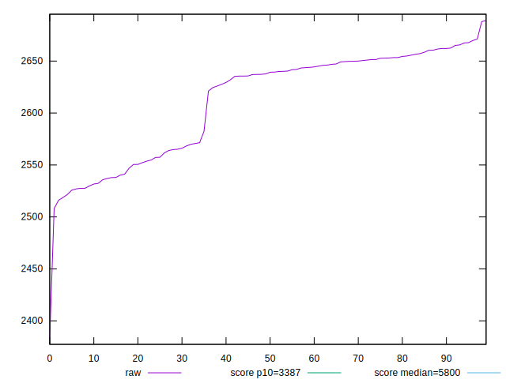
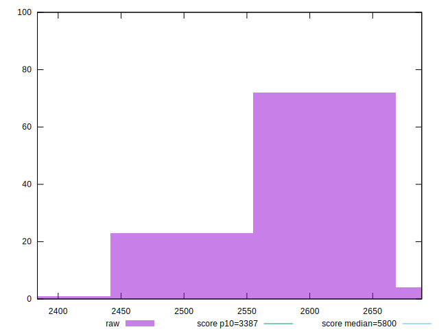
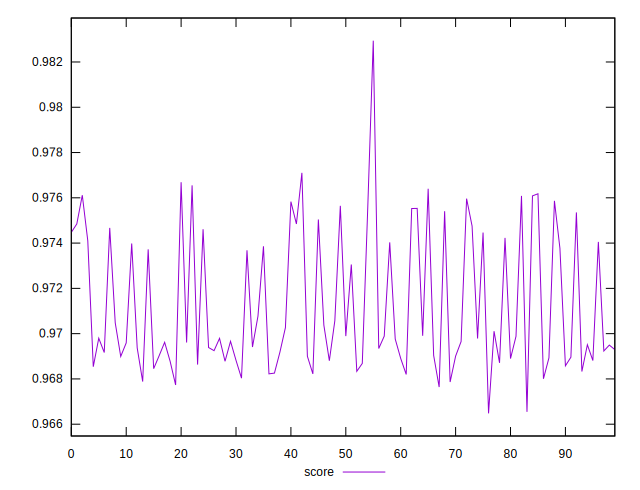
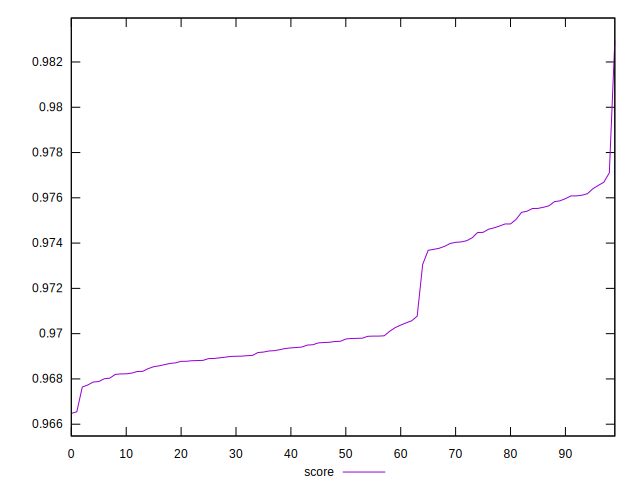
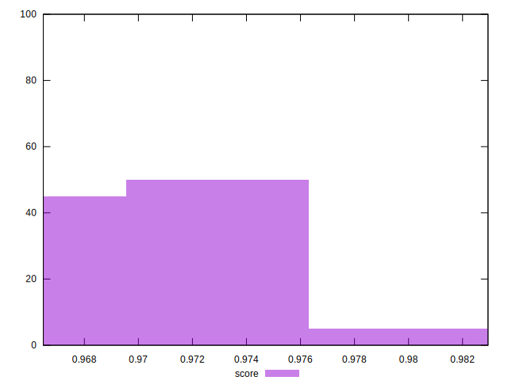

# //speed-index/samples/pages+cached+noexternal+noimg

[→ Parent](../..)


## Raw


```yaml
p90min: 2383.476745090407
p90max: 2662.1035776444737
p90range: 278.6268325540668
p90mean: 2603.6432005343627
p90median: 2635.6193249369016
p90stdev: 55.37260389610824
p90skewness: -0.982794062795715
p90eccentricity: 1.0000000000000002
p90discretization: 1
outlandishness: 1.0051674142809472

```


## Score


```yaml
p90min: 0.9664787269267197
p90max: 0.975865782697255
p90range: 0.009387055770535335
p90mean: 0.9706568456789935
p90median: 0.9695507793871008
p90stdev: 0.002676953315873963
p90skewness: 0.7627873411165241
p90eccentricity: 0.9999999999999997
p90discretization: 1
outlandishness: 1.0013097478293154

```

