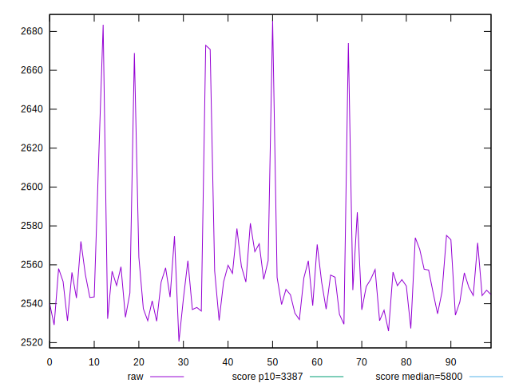
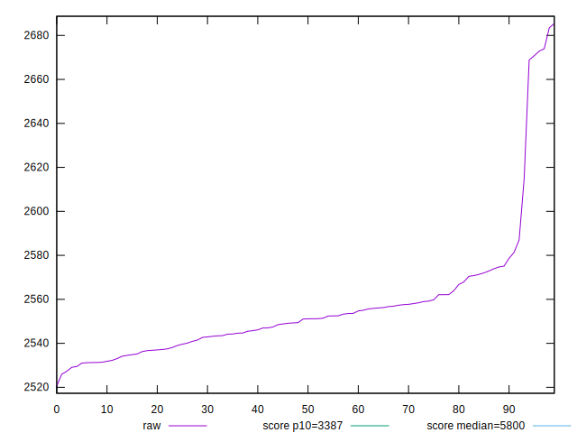
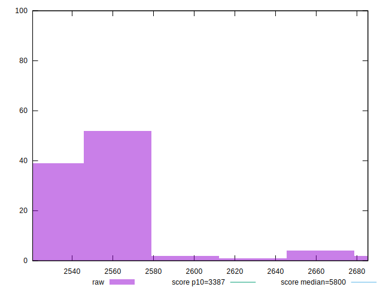
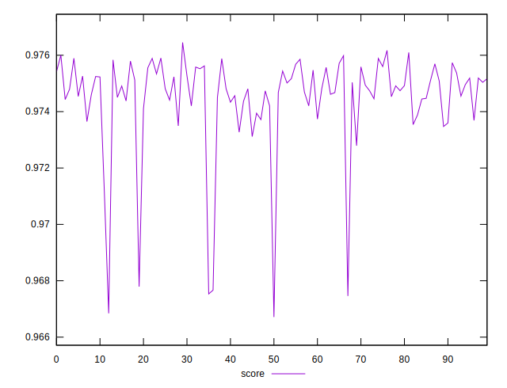
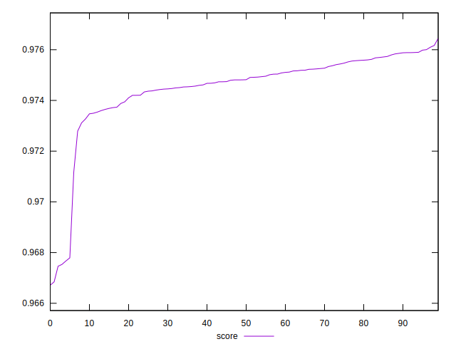
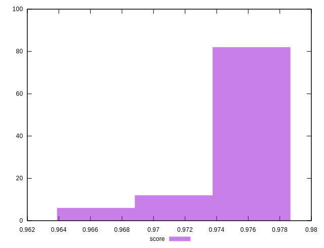

# //speed-index/samples/pages+cached+noexternal+nosvg

[→ Parent](../..)


## Raw


```yaml
p90min: 2527.308623229954
p90max: 2587.001728211144
p90range: 59.69310498119012
p90mean: 2550.075387733419
p90median: 2549.2706543195495
p90stdev: 13.489652450083765
p90skewness: 0.4701248863907129
p90eccentricity: 1.0000000000000002
p90discretization: 1
outlandishness: 1.006015685179536

```


## Score


```yaml
p90min: 0.9727908454139285
p90max: 0.9760981541802327
p90range: 0.003307308766304251
p90mean: 0.9748627701174372
p90median: 0.9749140535182812
p90stdev: 0.0007432498067661205
p90skewness: -0.5121620708201706
p90eccentricity: 1
p90discretization: 1
outlandishness: 0.9990570301852288

```


## P Score


```yaml
p90min: 0.9727908454139285
p90max: 0.9760981541802327
p90range: 0.003307308766304251
p90mean: 0.9748627701174372
p90median: 0.9749140535182812
p90stdev: 0.0007432498067661205
p90skewness: -0.5121620708201706
p90eccentricity: 1
p90discretization: 1
outlandishness: 0.9990570301852288

```


## Score Difference


```yaml
p90min: -0.004817534424544911
p90max: 0.004893506075720477
p90range: 0.009711040500265389
p90mean: 0.0000496469652453912
p90median: 0.0022088332361573926
p90stdev: 0.0042309645147096215
p90skewness: -0.020713597361042405
p90eccentricity: 1.0000000000000002
p90discretization: 1
outlandishness: 0.003721401852300342

```


## P Score Difference


```yaml
p90min: 0
p90max: 0
p90range: 0
p90mean: 0
p90median: 0
p90stdev: 0
p90skewness: .nan
p90eccentricity: .nan
p90discretization: 91
outlandishness: .nan

```

