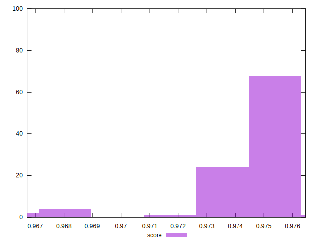

# //speed-index/samples/pages+cached+noexternal+nosvg

[→ Parent](../..)


## Raw


```yaml
p90min: 2520.577060921106
p90max: 2575.11317316203
p90range: 54.53611224092401
p90mean: 2548.4038775261024
p90median: 2548.650824938186
p90stdev: 12.736847218697346
p90skewness: 0.18591077035002798
p90eccentricity: 1.0000000000000002
p90discretization: 1
outlandishness: 1.0073358189108708

```


## Score


```yaml
p90min: 0.9667126651959529
p90max: 0.9758567821767505
p90range: 0.009144116980797645
p90mean: 0.9742238446321865
p90median: 0.9747399683460789
p90stdev: 0.0019970027958483663
p90skewness: -2.722220868073693
p90eccentricity: 1.0000000000000009
p90discretization: 1
outlandishness: 1.0003678835729668

```

