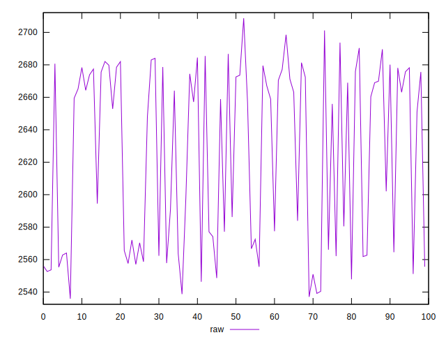
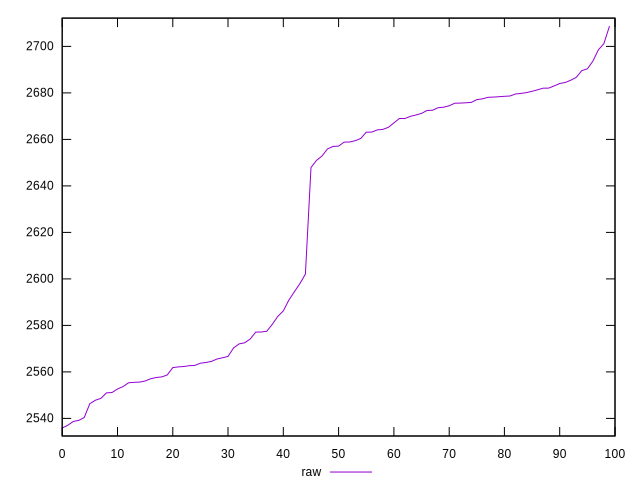
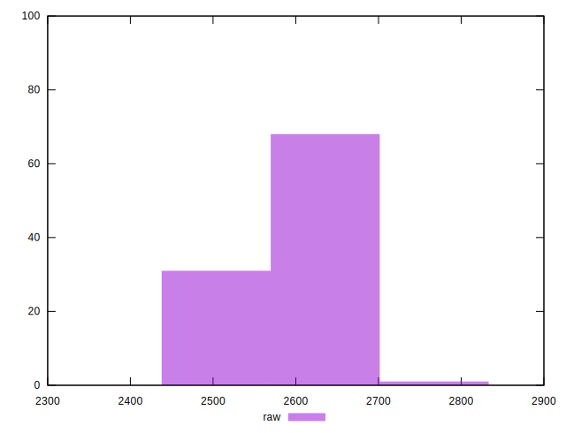
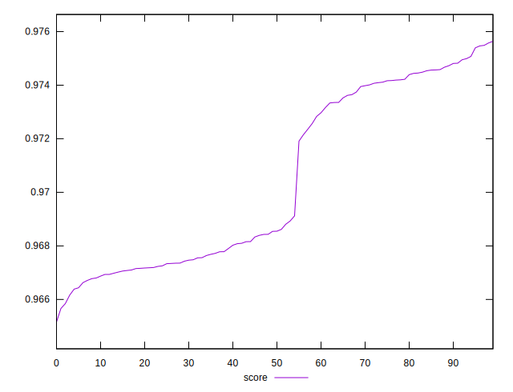
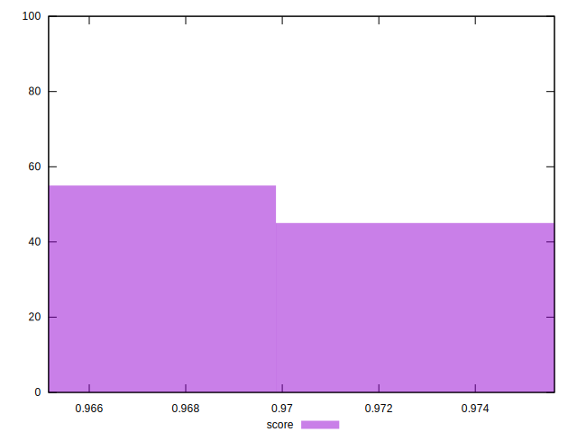

# //speed-index/samples/pages+cached+noexternal

[→ Parent](../..)


## Raw


```yaml
p90min: 2548.624666851664
p90max: 2698.518953410298
p90range: 149.89428655863367
p90mean: 2629.04737967325
p90median: 2658.900001397914
p90stdev: 53.42043148370363
p90skewness: -0.33395916668500486
p90eccentricity: 0.9999999999999999
p90discretization: 1
outlandishness: 0.9964574569036023

```


## Score


```yaml
p90min: 0.9661661326880311
p90max: 0.9749920107427816
p90range: 0.008825878054750547
p90mean: 0.9702755140370729
p90median: 0.9684324091598995
p90stdev: 0.0032359839210692066
p90skewness: 0.2821037613223533
p90eccentricity: 1
p90discretization: 1
outlandishness: 1.0003468633953168

```


## P Score


```yaml
p90min: 0.9661661326880311
p90max: 0.9749920107427816
p90range: 0.008825878054750547
p90mean: 0.9702755140370729
p90median: 0.9684324091598995
p90stdev: 0.0032359839210692066
p90skewness: 0.2821037613223533
p90eccentricity: 1
p90discretization: 1
outlandishness: 1.0003468633953168

```


## Score Difference


```yaml
p90min: -0.00456551245067216
p90max: 0.004842052868566982
p90range: 0.009407565319239142
p90mean: 0.0005365172214334266
p90median: 0.0019737262048776794
p90stdev: 0.003165715702844847
p90skewness: -0.5382443958699484
p90eccentricity: 1.0000000000000002
p90discretization: 1
outlandishness: 0.08478681109964142

```


## P Score Difference


```yaml
p90min: 0
p90max: 0
p90range: 0
p90mean: 0
p90median: 0
p90stdev: 0
p90skewness: .nan
p90eccentricity: .nan
p90discretization: 91
outlandishness: .nan

```

