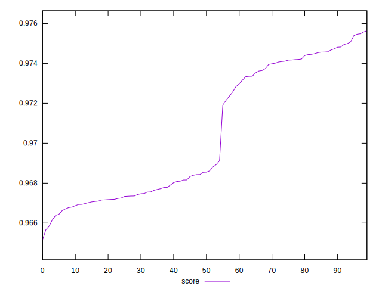

# //speed-index/samples/pages+cached+noexternal

[→ Parent](../..)


## Raw


```yaml
p90min: 2535.8910934574023
p90max: 2683.0030723373025
p90range: 147.1119788799001
p90mean: 2616.8433326393415
p90median: 2624.9723557570005
p90stdev: 54.967027237336666
p90skewness: -0.07539445749554322
p90eccentricity: 1.0000000000000002
p90discretization: 1
outlandishness: 1.0057733914280107

```


## Score


```yaml
p90min: 0.965157947131433
p90max: 0.9747292330877149
p90range: 0.009571285956281872
p90mean: 0.969912942670671
p90median: 0.968247380587012
p90stdev: 0.0032021668993074104
p90skewness: 0.39411645140391527
p90eccentricity: 1.0000000000000002
p90discretization: 1
outlandishness: 1.0010948994398303

```

