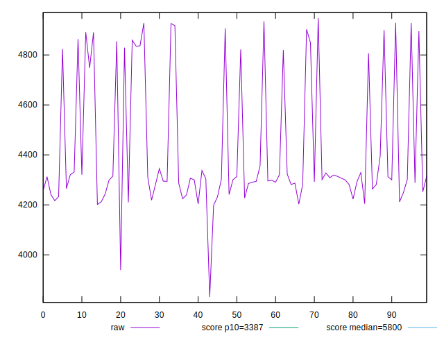
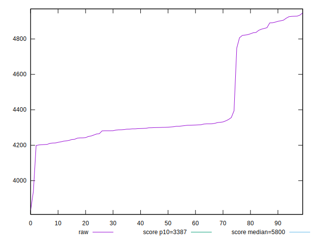
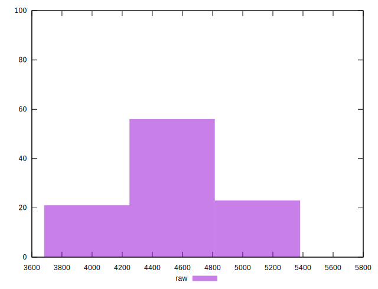
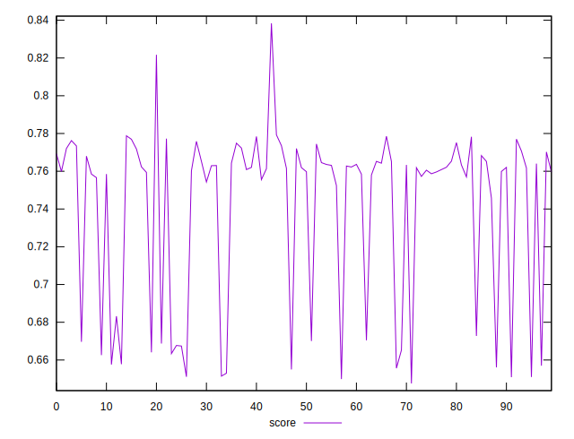
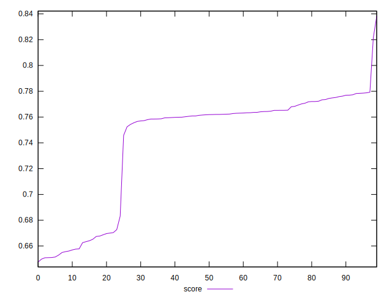
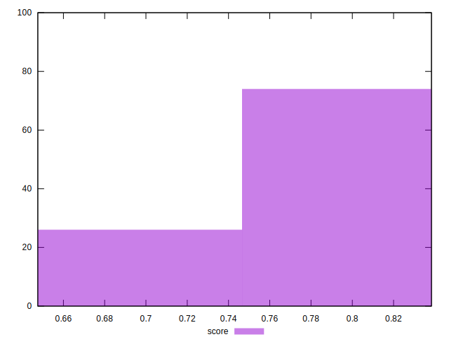

# //speed-index/samples/pages+cached+nointeractive

[→ Parent](../..)


## Raw


```yaml
p90min: 3831.5508418398394
p90max: 4894.85527176337
p90range: 1063.3044299235307
p90mean: 4365.824486896259
p90median: 4299.251326477848
p90stdev: 224.56395349109712
p90skewness: 1.3091155645191277
p90eccentricity: 1.0000000000000002
p90discretization: 1
outlandishness: 1.0256285157436518

```


## Score


```yaml
p90min: 0.6475964215263799
p90max: 0.7762488483872093
p90range: 0.12865242686082945
p90mean: 0.7350841495476037
p90median: 0.7607182092952021
p90stdev: 0.0466042390995287
p90skewness: -0.983590885054189
p90eccentricity: 1.0000000000000004
p90discretization: 1
outlandishness: 1.0145743635315407

```

