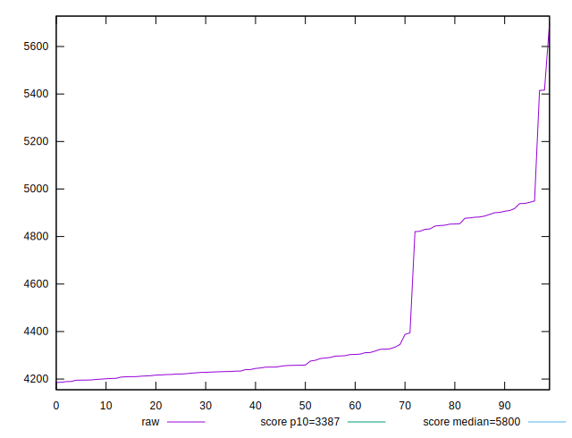
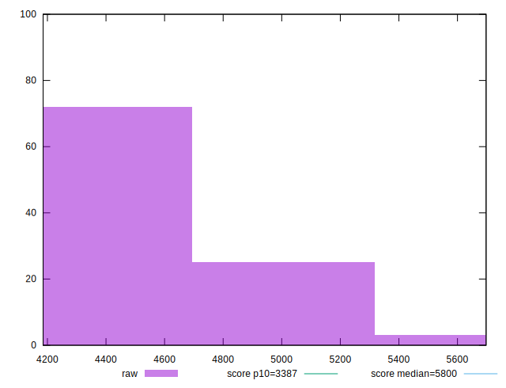

# //speed-index/samples/pages+cached

[→ Parent](../..)


## Raw


```yaml
p90min: 4185.297575146969
p90max: 4906.536446078288
p90range: 721.2388709313182
p90mean: 4377.55989609782
p90median: 4253.485344472458
p90stdev: 253.6723897941683
p90skewness: 1.3415847393734117
p90eccentricity: 1.0000000000000004
p90discretization: 1
outlandishness: 1.0309832985568559

```


## Score


```yaml
p90min: 0.654890920913918
p90max: 0.7815227336199034
p90range: 0.12663181270598545
p90mean: 0.7481051512059675
p90median: 0.769999026634016
p90stdev: 0.04460288363703897
p90skewness: -1.347676260070554
p90eccentricity: 1.0000000000000002
p90discretization: 1
outlandishness: 0.9685579700374084

```

