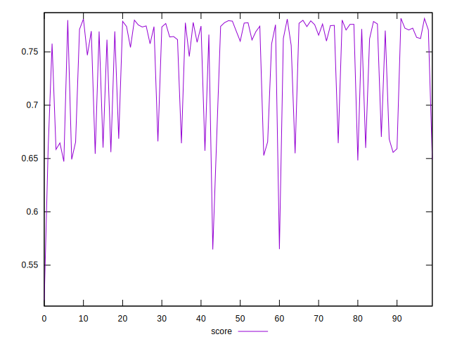

# //speed-index/samples/pages+cached

[→ Parent](../..)


## Raw


```yaml
p90min: 4185.297575146969
p90max: 4901.600841713289
p90range: 716.3032665663195
p90mean: 4371.682378875811
p90median: 4251.948320357909
p90stdev: 248.839433796211
p90skewness: 1.4012102664251183
p90eccentricity: 1.0000000000000002
p90discretization: 1
outlandishness: 1.0337573772766477

```


## Score


```yaml
p90min: 0.5169064002898659
p90max: 0.7788498268712115
p90range: 0.2619434265813456
p90mean: 0.7313663155875313
p90median: 0.7638043208699097
p90stdev: 0.059976398365549834
p90skewness: -1.27990573189945
p90eccentricity: 1
p90discretization: 1
outlandishness: 1.0134002358681329

```

