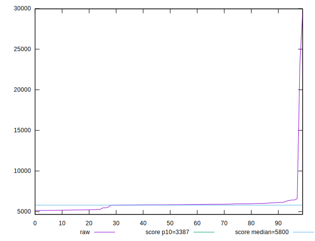

# //speed-index/samples/pages

[→ Parent](../..)


## Raw


```yaml
p90min: 5163.158730486796
p90max: 6599.640358850827
p90range: 1436.4816283640312
p90mean: 5784.716873487936
p90median: 5858.676026051887
p90stdev: 329.98575069845174
p90skewness: -0.546413125508188
p90eccentricity: 1.0000000000000002
p90discretization: 1
outlandishness: 1.1309853789248672

```


## Score


```yaml
p90min: 0.4023603053857956
p90max: 0.6098805730029377
p90range: 0.20752026761714215
p90mean: 0.5064722695422907
p90median: 0.49068682766718963
p90stdev: 0.054249974780310184
p90skewness: 0.7699543323457898
p90eccentricity: 1
p90discretization: 1
outlandishness: 0.9800747107233952

```


## P Score


```yaml
p90min: 0.4023603053857956
p90max: 0.6098805730029377
p90range: 0.20752026761714215
p90mean: 0.5064722695422907
p90median: 0.49068682766718963
p90stdev: 0.054249974780310184
p90skewness: 0.7699543323457898
p90eccentricity: 1
p90discretization: 1
outlandishness: 0.9800747107233952

```


## Score Difference


```yaml
p90min: -0.004365430344422161
p90max: 0.0035516126124757186
p90range: 0.00791704295689788
p90mean: -0.0008616786807947064
p90median: -0.001191292639184438
p90stdev: 0.002314661328112029
p90skewness: 0.3693782089288474
p90eccentricity: 1.0000000000000002
p90discretization: 1
outlandishness: 0.21665409114342865

```


## P Score Difference


```yaml
p90min: 0
p90max: 0
p90range: 0
p90mean: 0
p90median: 0
p90stdev: 0
p90skewness: .nan
p90eccentricity: .nan
p90discretization: 91
outlandishness: .nan

```

