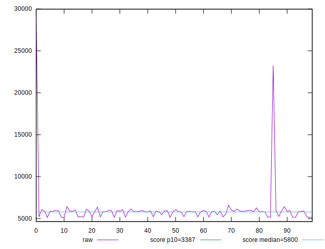
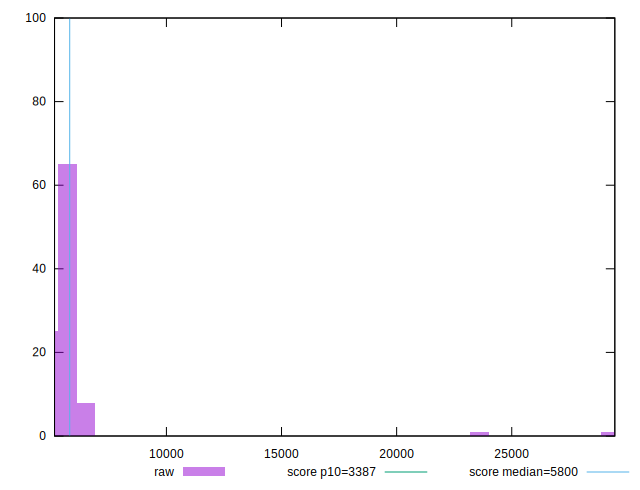

# //speed-index/samples/pages

[→ Parent](../..)


## Raw


```yaml
p90min: 5163.158730486796
p90max: 6599.640358850827
p90range: 1436.4816283640312
p90mean: 5784.716873487936
p90median: 5858.676026051887
p90stdev: 329.98575069845174
p90skewness: -0.546413125508188
p90eccentricity: 1.0000000000000002
p90discretization: 1
outlandishness: 1.1309853789248672

```


## Score


```yaml
p90min: 0.4023603053857956
p90max: 0.6098805730029377
p90range: 0.20752026761714215
p90mean: 0.5064722695422907
p90median: 0.49068682766718963
p90stdev: 0.054249974780310184
p90skewness: 0.7699543323457898
p90eccentricity: 1
p90discretization: 1
outlandishness: 0.9800747107233952

```

