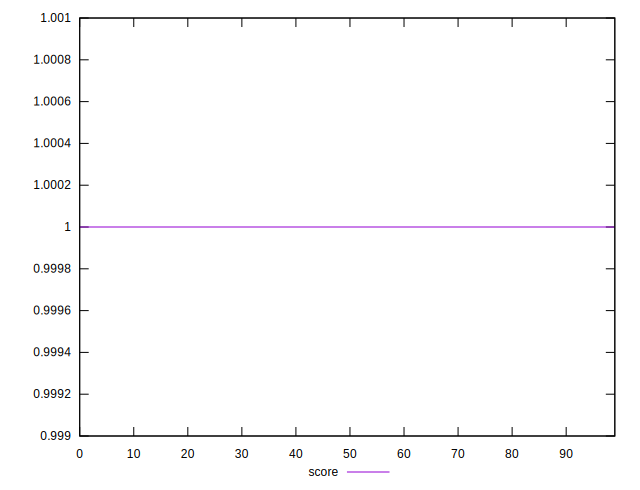

# //third-party-summary/samples/pages+cached+noexternal+nofonts

[→ Parent](../..)


## Raw


```yaml
? p90min
? p90max
? p90range
? p90mean
? p90median
? p90stdev
? p90skewness
? p90eccentricity
? p90discretization
? outlandishness

```


## Score


```yaml
p90min: 1
p90max: 1
p90range: 0
p90mean: 1
p90median: 1
p90stdev: 0
p90skewness: .nan
p90eccentricity: .nan
p90discretization: 90
outlandishness: 1

```

