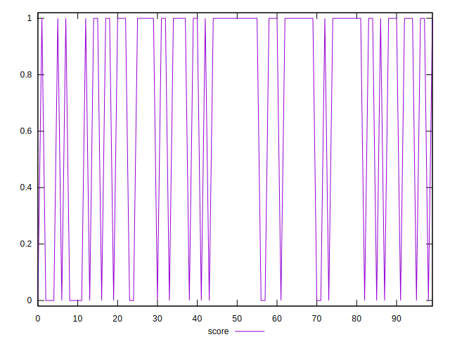
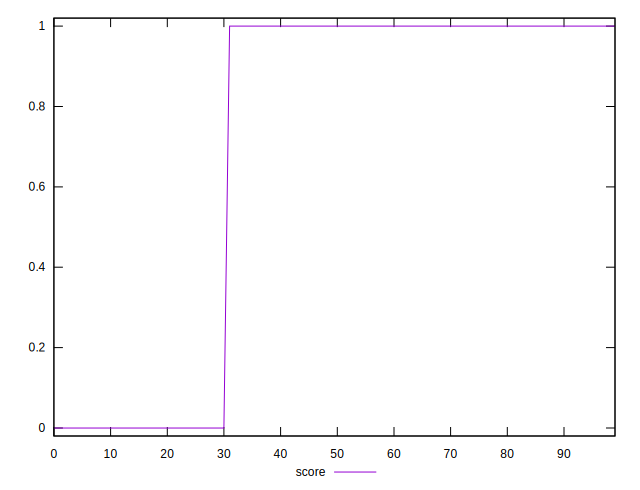
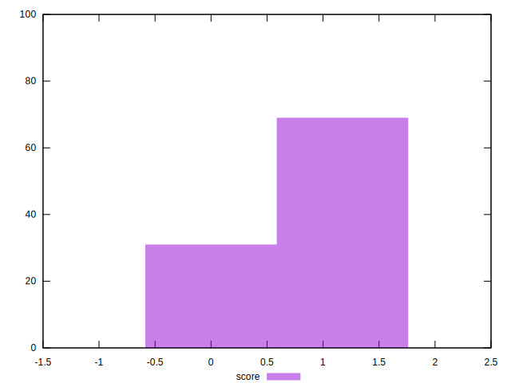

# //third-party-summary/samples/pages+cached+nointeractive

[→ Parent](../..)


## Raw


```yaml
p90min: null
p90max: null
p90range: 0
p90mean: null
p90median: null
p90stdev: null
p90skewness: null
p90eccentricity: null
p90discretization: null
outlandishness: null

```


## Score


```yaml
p90min: 0
p90max: 1
p90range: 1
p90mean: 0.7582417582417582
p90median: 1
p90stdev: 0.4281485656874321
p90skewness: -1.2063184554974613
p90eccentricity: 0.9999999999999984
p90discretization: 45.5
outlandishness: 0.8280999999999998

```

